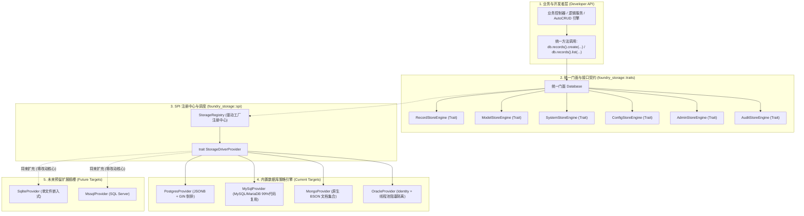

# Foundry 多数据库引擎与插件化存储架构改造路线图
# (Multi-Database & Pluggable Storage Architecture Roadmap)

> **版本定位**：`v0.2.0` ~ `v0.3.0`  
> **核心目标**：解耦当前单一 PostgreSQL 绑定，引入 **SPI (Service Provider Interface) 插件化机制** 与 **策略模式 (Strategy Pattern)**，实现底层驱动全面封装、上层纯方法调用，并支持多样化差异存储策略。  
> **支持矩阵**：
> - **核心已支持 / 计划支持**：PostgreSQL, MySQL, MariaDB, MongoDB, Oracle
> - **未来预留扩展（零核心代码修改）**：SQLite, SQL Server (MSSQL), TiDB 等

---

## 📌 状态图例
- [ ] **待开始 (Pending)**
- [/] **进行中 (In Progress)**
- [x] **已完成 (Completed)**

---

## 🧭 一、 核心设计哲学与四大原则

1. **面向方法调用，驱动零泄露 (Method-Based & Driver-Agnostic)**：
   - 业务子系统、AutoCRUD 引擎和开发者代码**只调用统一标准方法**（如 `db.records().create(...)`、`db.records().list(...)`）。
   - 严禁在业务层直接暴露 `sqlx::PgPool` 或任何数据库特定的连接对象。

2. **因地制宜的策略模式 (Database-Native Strategy)**：
   - **拒绝“最低公倍数 SQL”**：不同数据库拥有完全不同的物理特性，不强求底层 DDL 和查询使用同一套 SQL。
   - **PostgreSQL**：利用 `JSONB` + `USING GIN(data)` 倒排索引 + 部分索引实现真正的 Zero-DDL。
   - **MySQL / MariaDB**：统一驱动（复用度 99%），针对无 GIN 索引的短板提供“单表 JSON 模式”或“动态独立表 (Dynamic Sharding) 模式”。
   - **MongoDB**：利用其原生文档数据库本能，免 Schema 存储 BSON Document，天然契合海量动态记录。
   - **Oracle**：采用 Identity 自增与 JSON 检索，并通过专属线程池完成阻塞 C 驱动向异步 Tokio 的无感隔离。

3. **对修改关闭，对扩展开放 (Pluggable SPI & Registry Pattern)**：
   - 核心层只依赖 `StorageDriverProvider` 抽象契约与全局驱动注册中心 `StorageRegistry`。
   - 新增数据库（如 SQLite 或 SQL Server）时，**无需修改现有任何核心业务代码**，仅需新增一个 Provider 并注册即可生效。

4. **条件编译与按需引入 (Cargo Feature Flags)**：
   - 杜绝依赖膨胀：每个数据库驱动均作为独立可选的 Feature（例如仅使用 MySQL 的用户无需拉取 Oracle C 库或 MongoDB 依赖）。

---

## 🏗️ 二、 目标系统架构全景



---

## 📁 三、 目录与代码结构重构规范

重构后 `crates/foundry_storage` 模块的规范布局：

```text
crates/foundry_storage/
├── Cargo.toml                         # Feature Flags 控制 (postgres, mysql, mongodb, oracle, sqlite)
├── migrations/                        # 各引擎特化的全量初始化与迁移脚本
│   ├── postgres/                      # PostgreSQL 方言脚本 (BIGSERIAL, JSONB, GIN, PL/pgSQL)
│   │   └── init.sql
│   ├── mysql/                         # MySQL & MariaDB 方言脚本 (AUTO_INCREMENT, JSON, 复合索引)
│   │   └── init.sql
│   └── oracle/                        # Oracle 方言脚本 (IDENTITY, TIMESTAMP WITH TIME ZONE)
│       └── init.sql
└── src/
    ├── lib.rs                         # 统一导出门面 Database 与全部业务 Store Traits
    ├── facade.rs                      # Database 结构体与统一 API 暴露
    ├── entities.rs                    # 通用实体模型 (System, Model, Record, Admin, AuditLog)
    ├── traits/                        # 【业务契约层】面向开发者的方法 Trait
    │   ├── mod.rs
    │   ├── records.rs                 # RecordStoreEngine: list, get_by_id, create, update, delete
    │   ├── models.rs                  # ModelStoreEngine: list_models, get_model, create_model...
    │   ├── systems.rs                 # SystemStoreEngine: list, get_by_slug, stats...
    │   ├── configs.rs                 # ConfigStoreEngine: list, get_aggregated, update...
    │   ├── admins.rs                  # AdminStoreEngine: list, get_by_username, create...
    │   └── audit.rs                   # AuditStoreEngine: insert, list...
    ├── spi/                           # 【SPI 扩展层】未来接入新数据库的核心接口
    │   ├── mod.rs
    │   ├── provider.rs                # StorageDriverProvider trait 定义
    │   └── registry.rs                # StorageRegistry: 驱动注册与根据连接串查找
    └── engines/                       # 【具体策略实现层】各个数据库的特化方言与驱动实现
        ├── mod.rs
        ├── postgres/                  # PostgreSQL 引擎实现
        │   ├── mod.rs
        │   ├── provider.rs            # PostgresProvider
        │   ├── records.rs             # GIN 索引与 JSONB 操作
        │   └── stores.rs              # models, systems, admins 等实现
        ├── mysql/                     # MySQL & MariaDB 统一引擎 (99% 复用)
        │   ├── mod.rs
        │   ├── provider.rs            # MySqlProvider
        │   ├── records.rs             # MySQL JSON 操作、自增主键与无 RETURNING 处理
        │   └── stores.rs              # 各基础表实现
        ├── mongodb/                   # MongoDB 原生文档引擎
        │   ├── mod.rs
        │   ├── provider.rs            # MongoProvider
        │   ├── records.rs             # 原生 BSON 文档 CRUD 与 Wildcard 动态索引
        │   └── stores.rs              # 基础集合存储
        └── oracle/                    # Oracle 企业引擎
            ├── mod.rs
            ├── provider.rs            # OracleProvider
            ├── records.rs             # Oracle JSON 检索与方言
            └── worker.rs              # tokio::task::spawn_blocking 阻塞调用隔离池
```

---

## 🧩 四、 核心代码接口设计

### 1. `StorageDriverProvider` (SPI 扩展契约)

```rust
#[async_trait]
pub trait StorageDriverProvider: Send + Sync {
    /// 驱动标识，如 "postgres", "mysql", "mariadb", "mongodb", "oracle", "sqlite", "mssql"
    fn driver_name(&self) -> &'static str;

    /// 判断连接字符串是否归当前 Provider 处理 (例如 starts_with("mysql://"))
    fn supports(&self, connection_url: &str) -> bool;

    /// 初始化连接池并构建全套仓储引擎
    async fn create_engines(
        &self,
        connection_url: &str,
        max_connections: u32,
    ) -> AppResult<StorageEngineSet>;

    /// 执行该数据库特有的初始化迁移脚本
    async fn run_migrations(&self, connection_url: &str) -> AppResult<()>;
}
```

### 2. `RecordStoreEngine` (统一动态数据操作 Trait)

```rust
#[async_trait]
pub trait RecordStoreEngine: Send + Sync {
    async fn list(
        &self,
        system_slug: &str,
        model_slug: &str,
        query: RecordQuery,
    ) -> AppResult<PaginatedData<ModelRecordEntity>>;

    async fn get_by_id(
        &self,
        system_slug: &str,
        model_slug: &str,
        id: i64,
    ) -> AppResult<ModelRecordEntity>;

    async fn create(
        &self,
        system_slug: &str,
        model_slug: &str,
        data: serde_json::Value,
    ) -> AppResult<ModelRecordEntity>;

    async fn update(
        &self,
        system_slug: &str,
        model_slug: &str,
        id: i64,
        data: serde_json::Value,
    ) -> AppResult<ModelRecordEntity>;

    async fn delete(
        &self,
        system_slug: &str,
        model_slug: &str,
        id: i64,
    ) -> AppResult<()>;
}
```

### 3. `Database` (面向开发者的纯方法调用门面)

```rust
#[derive(Clone)]
pub struct Database {
    records: Arc<dyn RecordStoreEngine>,
    models: Arc<dyn ModelStoreEngine>,
    systems: Arc<dyn SystemStoreEngine>,
    configs: Arc<dyn ConfigStoreEngine>,
    admins: Arc<dyn AdminStoreEngine>,
    audit: Arc<dyn AuditStoreEngine>,
}

impl Database {
    /// 根据配置中的 DATABASE_URL 自动路由匹配驱动
    pub async fn connect(url: &str, max_connections: u32, auto_migrate: bool) -> AppResult<Self>;

    pub fn records(&self) -> &dyn RecordStoreEngine { self.records.as_ref() }
    pub fn models(&self) -> &dyn ModelStoreEngine { self.models.as_ref() }
    pub fn systems(&self) -> &dyn SystemStoreEngine { self.systems.as_ref() }
    pub fn configs(&self) -> &dyn ConfigStoreEngine { self.configs.as_ref() }
    pub fn admins(&self) -> &dyn AdminStoreEngine { self.admins.as_ref() }
    pub fn audit(&self) -> &dyn AuditStoreEngine { self.audit.as_ref() }
}
```

---

## 🎯 五、 各数据库策略特化实现细节

### 1. PostgreSQL 策略
- **表结构**：保持当前 `model_records`，字段 `data JSONB NOT NULL DEFAULT '{}'::jsonb`。
- **索引**：
  - `CREATE INDEX idx_lookup ON model_records(system_id, model_slug, created_at DESC) WHERE deleted_at IS NULL;`（部分索引）
  - `CREATE INDEX idx_data_gin ON model_records USING GIN(data);`（任意 JSON 属性倒排索引）
- **SQL 方言**：占位符 `$1, $2`；写入利用 `INSERT ... RETURNING *` 一次网络 IO 获取自增与生成数据。

### 2. MySQL & MariaDB 统一策略 (复用度 99%)
- **统一驱动**：采用 `sqlx` 的 `mysql` feature，同一份驱动代码同时支持 MySQL 8.0+ 和 MariaDB 10.5+。
- **表结构差异适配**：
  - 主键：`BIGINT NOT NULL AUTO_INCREMENT PRIMARY KEY`。
  - 时间类型：`DATETIME(6) NOT NULL DEFAULT CURRENT_TIMESTAMP(6)`。
  - 数据类型：`data JSON NOT NULL`。
  - 索引替代：MySQL 不支持部分索引，退化为普通联合索引 `(system_id, model_slug, deleted_at, created_at)`。
- **无 RETURNING 适配**：MySQL 8.0 不支持 `INSERT ... RETURNING`，底层驱动策略自动封装为：在事务内执行 `INSERT` -> 通过 `res.last_insert_id()` 获取 ID -> `SELECT` 完整行并返回。
- **动态查询策略**：
  - **默认模式**：标准 JSON 存储 + B-Tree 索引辅助。
  - **扩展模式**：根据 `model_fields` 中声明为 `is_required` 或加了检索索引的字段，自动生成 MySQL 虚拟生成列 (Virtual Generated Columns) 并挂载局部 B-Tree 索引。

### 3. MongoDB 原生文档策略 (亮点与强项)
- **文档映射**：
  - `model_records` 映射为 MongoDB 集合中的原生 Document，例如：
    ```json
    {
      "_id": ObjectId("..."),
      "id": 100001,
      "system_id": "carnival_2026",
      "model_slug": "products",
      "data": { "title": "Keyboard", "price": 99, "tags": ["tech"] },
      "created_at": ISODate("..."),
      "deleted_at": null
    }
    ```
- **自增 ID 保证**：维护一个轻量 `counters` 集合或者将自增映射为 Snowflake / ObjectId，保证对外 `id: i64` 接口契约一致。
- **原生动态索引**：利用 MongoDB 的 `Wildcard Index` (`data.$**`)，天然支持对任意 JSON 路径进行索引加速，完全免去 DDL 烦恼。
- **驱动**：官方 `mongodb` crate 纯异步 Tokio 支持。

### 4. Oracle 企业策略
- **表结构差异适配**：
  - 主键：`id NUMBER(19) GENERATED ALWAYS AS IDENTITY PRIMARY KEY`。
  - 时间类型：`TIMESTAMP WITH TIME ZONE`。
  - JSON 存储：Oracle 19c 使用 `CLOB CHECK (data IS JSON)`；Oracle 21c+ 使用原生二进制 `JSON` 类型。
  - 索引：使用 Oracle Text 提供的 `CREATE SEARCH INDEX idx_data_search ON model_records(data) FOR JSON;`。
- **异步隔离 (Spawn Blocking)**：
  - `rust-oracle` 基于 C 动态库（ODPI-C），操作是同步阻塞的。
  - 在 `engines/oracle/worker.rs` 中利用 `tokio::task::spawn_blocking` 将连接与查询隔离在专属阻塞线程池中，对外依然暴露纯净的 `async fn`。

---

## 🔮 六、 未来扩展演示：如何接入新数据库（以 SQLite 为例）

当未来某天需要接入 SQLite 时，**现有代码 0 修改**，只需 3 步：

1. **步骤 1**：编写 `engines/sqlite/provider.rs` 实现 `StorageDriverProvider`：
   ```rust
   pub struct SqliteProvider;
   #[async_trait]
   impl StorageDriverProvider for SqliteProvider {
       fn driver_name(&self) -> &'static str { "sqlite" }
       fn supports(&self, url: &str) -> bool { url.starts_with("sqlite://") }
       async fn create_engines(&self, url: &str, _) -> AppResult<StorageEngineSet> {
           let pool = sqlx::SqlitePool::connect(url).await?;
           Ok(StorageEngineSet {
               records: Arc::new(SqliteRecordEngine { pool: pool.clone() }),
               // ...
           })
       }
       async fn run_migrations(&self, url: &str) -> AppResult<()> { ... }
   }
   ```
2. **步骤 2**：在应用启动或驱动注册入口处注册：
   ```rust
   registry.register(Box::new(SqliteProvider));
   ```
3. **步骤 3**：环境变量配置 `DATABASE_URL=sqlite://foundry.db`，系统即可全自动运行在 SQLite 上！

---

## 📅 七、 详细落地实施阶段规划

```
[阶段 1: SPI 机制与 Trait 抽象] ➔ [阶段 2: 迁移 PG 验证架构] ➔ [阶段 3: MySQL / MariaDB 统一策略]
                                                                        │
[阶段 6: 扩展性验收与文档发布] ⬅ [阶段 5: Oracle 企业引擎]  ⬅ [阶段 4: MongoDB 原生文档引擎]
```

### 阶段 1: 核心 SPI 架构与 Trait 契约抽象（基础底座）
- [ ] 1.1 在 `crates/foundry_storage/src/traits/` 中定义 `RecordStoreEngine`、`ModelStoreEngine`、`SystemStoreEngine` 等标准业务 Trait。
- [ ] 1.2 在 `crates/foundry_storage/src/spi/` 中定义 `StorageDriverProvider` 契约与 `StorageRegistry` 注册管理器。
- [ ] 1.3 改造 `crates/foundry_storage/Cargo.toml`，配置 Feature Flags (`postgres`, `mysql`, `mongodb`, `oracle`)。
- [ ] 1.4 实现顶层门面结构体 `Database`（完全隐藏底层 Pool，只暴露方法）。

### 阶段 2: PostgreSQL 策略提取与既有系统无缝兼容
- [ ] 2.1 将当前 `foundry_storage` 内部现有的硬编码 PG 逻辑重构至 `engines/postgres/`。
- [ ] 2.2 实现 `PostgresProvider`，挂载进 Registry。
- [ ] 2.3 改造 `foundry_engine::AppState` 与 `foundry::FoundryApp::builder()`，将 `DbPool` 切换为 `Database` 门面。
- [ ] 2.4 运行 `cargo test`、`integration_test.rs` 与 CLI 冒烟测试，确保现有 PostgreSQL 功能 100% 行为兼容。

### 阶段 3: MySQL & MariaDB 统一策略引擎落地
- [ ] 3.1 编写 `migrations/mysql/init.sql`，处理 `AUTO_INCREMENT`、`DATETIME(6)` 与标准复合索引。
- [ ] 3.2 编写 `engines/mysql/` 统一策略模块，实现基于 `sqlx::MySqlPool` 的连接管理。
- [ ] 3.3 实现 MySQL 方言下的 `RecordStoreEngine`（事务包装 `INSERT` -> `last_insert_id()` -> `SELECT`）。
- [ ] 3.4 在本地 `dev/docker-compose.yml` 中追加 MySQL 8.0 容器配置与初始化脚本。
- [ ] 3.5 编写端到端集成测试，验证 `DATABASE_URL=mysql://...` 下 AutoCRUD 的完整功能。

### 阶段 4: MongoDB 原生文档策略引擎落地
- [ ] 4.1 引入 `mongodb` 官方异步驱动至 `Cargo.toml`。
- [ ] 4.2 编写 `engines/mongodb/` 策略模块，实现 BSON 文档与 `ModelRecordEntity` 的双向序列化。
- [ ] 4.3 实现动态索引初始化（Compound Index 与 Wildcard Index）。
- [ ] 4.4 编写 MongoDB 的集成测试，验证动态 JSON 结构的保存与分页查询。

### 阶段 5: Oracle 企业引擎与阻塞隔离落地
- [ ] 5.1 引入 `oracle` 与 `r2d2` 依赖（挂在 `oracle` feature 开关下）。
- [ ] 5.2 编写 `engines/oracle/` 策略模块，编写 `NUMBER(19) GENERATED ALWAYS AS IDENTITY` 方言脚本。
- [ ] 5.3 实现 `tokio::task::spawn_blocking` 工作线程池包裹机制，确保高并发 Axum 运行时不受 C 阻塞调用影响。
- [ ] 5.4 编写配套的 Dockerfile，配置 Oracle Instant Client 动态链接库运行环境。

### 阶段 6: 扩展性验证、开发指南与发布
- [ ] 6.1 编写一个单元测试，在测试中注入一个轻量级 `MockDriverProvider`，证明“零改动核心代码新增数据库”的有效性。
- [ ] 6.2 更新用户指南文档 `docs/src/content/docs/zh/guides/database.md`，给出不同数据库的配置样例与选型建议。
- [ ] 6.3 更新主版本路线图 `docs/src/content/docs/zh/roadmap.md`，正式发布多引擎支持里程碑。
