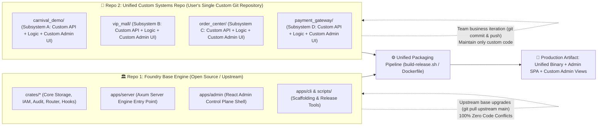

# Foundry Architecture Blueprint

> **Organization**: [foundkit](https://github.com/foundkit)  
> **Project**: `foundry`  
> **Tagline**: *Build complete systems from a common foundation.*  
> **Repository Description**: *Foundry is an open-source platform for building and running multiple independent backend systems from a shared foundation.*

---

## 1. Product Vision & Positioning

### 1.1 What is Foundry?
**Foundry** is a complete, self-contained, open-source **Multi-System Backend Platform & Management Product** (Backend-as-a-Service / Multi-Tenant Infrastructure Engine).

Foundry adopts a **"Base Infrastructure Engine + Unified Custom Systems Repository"** two-repository decoupled architecture:
- **Base Infrastructure Repository (`foundry`)**: Provides pure generic platform infrastructure (Axum server engine, PostgreSQL Zero-DDL storage, Redis tenant namespace caching, Admin IAM, non-GET operation audit trail, React Admin control plane SPA, release packaging tooling).
- **Unified Custom Systems Repository (`foundry-custom` / `foundry-systems`)**: **A single repository containing ALL custom subsystem code for the user or organization** (custom APIs + domain services + custom Admin UI views + manifests).



### 1.2 Core Value Propositions
1. **Single Custom Repository Maintenance**: Users and teams only need to maintain ONE Git repository containing all their business subsystems, where each subsystem is an isolated directory.
2. **0-Conflict Upgrades**: Core platform code is maintained by the Foundry open-source team. Upgrading the base engine (`git pull upstream main` or updating the Docker base image) never causes merge conflicts with your private business logic.
3. **Self-Contained Subsystem Directory Standard**: Each subsystem folder self-contains its custom API controllers, domain logic services, DTO validation schemas, custom admin UI pages (`custom_pages/`), and manifest (`subsystem.json`).
4. **Multi-Tenant System Engine**: Run $N$ independent apps within a single deployed Foundry instance with strict tenant data and cache isolation.
5. **Visual One-Click System & Model Generation (Admin UI + Auto-CRUD)**: Modern Web Admin Panel to graphically create subsystems, define dynamic data schemas, and automatically expose RESTful APIs.
6. **Hierarchical Admin IAM & Topic-Scoped RBAC**: Super Admin (`super_admin`) and scoped Topic Admins (`allowed_systems: ["carnival_demo"]`).
7. **Comprehensive Non-GET Operation Audit Trail**: Security-first middleware recording every state-mutating request (POST, PUT, PATCH, DELETE, login).
8. **Unified Release Packaging Pipeline**: Merge base infrastructure and your single custom systems repo into a production binary or container in one step.

---

## 2. Repository Layout & Decoupling Standard

### 2.1 Base Platform Repository (`foundry`)

```
foundry/                         # Base Platform Repository (Open-Source / Upstream)
├── README.md                    # Product overview & getting started guide
├── docs/                        # Architecture & development documentation
│   ├── astro.config.mjs         # Starlight documentation config
│   ├── package.json             # Documentation dependencies
│   └── src/content/docs/        # Multilingual documentation
├── migrations/                  # Baseline database initialization (`init.sql`)
├── apps/                        # Executable Applications
│   ├── server/                  # Foundry Core Server (Rust / Axum binary entry point)
│   ├── admin/                   # Visual Web Admin Dashboard SPA (React / Vite / Tailwind)
│   └── cli/                     # Developer CLI Tool (System scaffolding, repo validation)
├── crates/                      # Modular Backend Core Crates (Rust Workspace)
│   ├── foundry_core/            # SystemContext, SubsystemModule, CustomAdminPageSpec
│   ├── foundry_storage/         # Dynamic schema engine, ORM abstraction (SQLx)
│   ├── foundry_auth/            # Admin IAM, Argon2id, JWT & Topic RBAC
│   ├── foundry_engine/          # Multi-system router, Auto-CRUD API generator, Audit Interceptor
│   └── foundry_extension/       # Mutation hooks & WASM extension pipeline
├── systems/                     # Sub-System workspace (Git Submodule mount point for custom repo)
│   └── src/                     # Sub-system registry & static/dynamic router loader
├── external_systems/            # Standalone external subsystem directory
├── scripts/                     # Build & Packaging Tooling (build-release.sh)
└── docker/                      # Containerization & Deployment
    ├── Dockerfile               # Production multi-stage build (Server + Admin UI + Subsystems)
    └── docker-compose.yml       # Local dev setup (Foundry + PostgreSQL 18.6+ + Redis 8+)
```

---

### 2.2 User's Unified Custom Systems Repository (`foundry-systems`)

A single Git repository maintained internally by the team containing all custom subsystems:

```
foundry-systems/                 # User's Single Custom Systems Git Repository
├── Cargo.toml                   # Systems workspace definition
├── README.md                    # Business documentation
├── carnival_demo/               # Subsystem A: Campaign (Self-contained)
│   ├── mod.rs                   # Entry & SubsystemModule trait implementation
│   ├── subsystem.json           # Subsystem manifest & custom admin page specifications
│   ├── controllers/             # Custom HTTP Controllers (Axum Handlers)
│   ├── logic/                   # Domain business services
│   ├── dto/                     # Request/Response DTOs & Validation schemas
│   └── custom_pages/            # Custom Admin UI views (HTML/React)
│       ├── lottery_dashboard.html
│       └── wheel_control.html
├── vip_mall/                    # Subsystem B: VIP Mall (Self-contained)
│   ├── mod.rs
│   ├── subsystem.json
│   ├── controllers/
│   ├── logic/
│   ├── dto/
│   └── custom_pages/
│       └── overview.html
├── order_center/                # Subsystem C: Orders (Self-contained)
│   └── ...
└── payment_gateway/             # Subsystem D: Payments (Self-contained)
    └── ...
```

---

## 3. Decoupled Architecture & Development Workflow

### 3.1 Self-Contained Subsystem Directory Standard

Each subsystem directory is self-contained with five core dimensions:
1. **API & Controllers (`controllers/`)**: Axum route handlers mounted under `/api/v1/s/{slug}/ext/*`.
2. **Domain Business Logic (`logic/`)**: Pure business logic, transactions, state machines.
3. **Contracts & DTOs (`dto/`)**: Request inputs and response payloads with `validator` declarative constraints.
4. **Custom Admin UI Pages (`custom_pages/`)**: Dedicated operational views (HTML / React) mounted under `/api/v1/s/{slug}/ext/custom-pages/*` and communicating with the Foundry Admin UI shell via `FoundryBridge`.
5. **Manifest Metadata (`subsystem.json`)**: Declares slug, name, version, and custom page specs.

---

### 3.2 Local Development Modes

| Mode | Configuration | Best For |
| :--- | :--- | :--- |
| **Mode A: Git Submodule (Recommended)** | Mount `foundry-systems` as submodule at `foundry/systems/` | Native Cargo Workspace compilation, cross-crate IDE navigation, maximum performance |
| **Mode B: Environment Pointer** | `export FOUNDRY_SYSTEMS_DIR=/path/to/foundry-systems` | Fast setup without altering repository worktree |
| **Mode C: Symlink** | `ln -s /path/to/foundry-systems external_systems/my_systems` | Multi-repo local rapid prototyping |

---

## 4. Unified Production Release Packaging

```bash
# 1. Run release packaging script with custom systems repository path
./scripts/build-release.sh --systems-dir /path/to/foundry-systems

# 2. Or build production Docker container
docker build -t foundry-app:latest -f docker/Dockerfile .
```

Produces a single deployment bundle in `dist/release/` containing the compiled server binary (`foundry-server`), the React Admin SPA, and all custom subsystem pages.

