# Foundry Architecture Blueprint

> **Organization**: [foundkit](https://github.com/foundkit)  
> **Project**: `foundry`  
> **Tagline**: *Build complete systems from a common foundation.*  
> **Repository Description**: *Foundry is an open-source platform for building and running multiple independent backend systems from a shared foundation.*

---

## 1. Product Vision & Positioning

### 1.1 What is Foundry?
**Foundry** is a complete, self-contained, open-source **Multi-System Backend Platform & Management Product** (Backend-as-a-Service / Multi-Tenant Infrastructure Engine).

Unlike single-project BaaS solutions (such as Strapi, Directus, PocketBase, or Supabase) which deploy one instance per content model scope, **Foundry is built from the ground up as a Monorepo product to manage multiple independent systems from a unified foundation.**

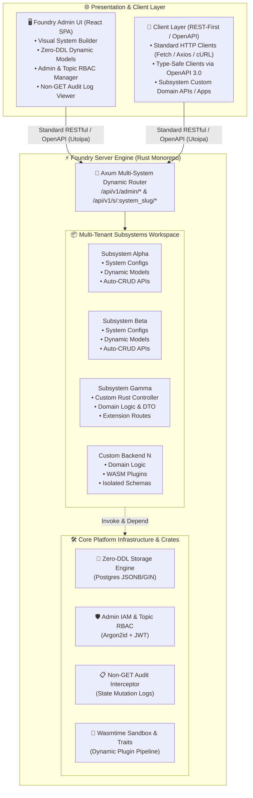

### 1.2 Core Value Propositions
1. **Multi-Tenant System Engine**:
   Run and manage $N$ independent sub-systems (App backends, mini-programs, marketing campaign sites) within a single deployed Foundry instance with strict tenant isolation.
2. **Visual One-Click System & Model Generation (Admin UI + Auto-CRUD)**:
   A modern Web Admin Panel allowing users to graphically construct sub-systems, define dynamic data schemas, and automatically expose high-performance RESTful APIs with fine-grained access control toggles.
3. **Code-First Custom Endpoint & Logic Extensibility**:
   First-class support for creating dedicated sub-system code packages with distinct unique identifiers (`system_slug`), custom controller directories (`controllers/`), business logic services (`logic/`), and DTO validation layers (`dto/`), seamlessly integrated with shared infrastructure and Axum routing.
4. **Pure Infrastructure Foundation & Sub-System Domain Autonomy**:
   Foundry is strictly positioned as a generic, unopinionated infrastructure platform. In the foundational phase, the platform does not bundle redundant public business modules (no platform-wide points tables, no form tables, and no unified end-user authentication center). Each sub-system possesses complete autonomy to design its own user authentication, domain entities, and business logic.
5. **Hierarchical Admin IAM & Topic-Scoped RBAC**:
   Built-in administrator authorization model. System initialization provisions a Super Admin (`super_admin`) with omnipotent privileges across all sub-systems (`["*"]`). The Super Admin can create normal administrators (`admin`) and delegate management rights to specific topics (`allowed_systems: ["carnival_2026"]`).
6. **Comprehensive Non-GET Operation Audit Trail**:
   Security-first auditing middleware that automatically captures every non-GET request (POST, PUT, PATCH, DELETE, login) executed by administrators, recording the operator, target sub-system, path, dynamic operation name, full request payload/parameters, IP, status code, and latency.
7. **Hybrid Extension Engine (Rust Traits + Wasmtime Sandbox)**:
   Extend any sub-system using native **Rust traits** for maximum performance or sandboxed **Wasm plugins** for runtime hot-reloading without server restarts.
8. **REST-First & OpenAPI-Native Architecture**:
   Zero client-vendor lock-in. Clean, standardized REST endpoints with auto-generated OpenAPI 3.0 definitions allowing clients to connect directly without mandatory SDK dependencies.

---

## 2. Monorepo Repository Structure

Foundry is organized as a unified Monorepo containing the Rust Backend Engine, Sub-System Custom Code Packages, Visual Web Admin Dashboard SPA, Developer CLI, and Modular Backend Crates.

```
foundry/                         # Monorepo Root
├── README.md                    # Product overview & getting started guide
├── docs/                        # Architecture & development documentation
│   ├── architecture.md          # Full product architecture blueprint
│   └── todo.md                  # Development roadmap & task tracker
├── migrations/                  # Database initialization & migrations
│   └── init.sql                 # Baseline PostgreSQL schema (Zero-DDL tables)
├── apps/                        # Executable Applications
│   ├── server/                  # Foundry Core Server (Rust / Axum binary entry point)
│   ├── admin/                   # Visual Web Admin Dashboard SPA (React / Vite / Tailwind)
│   │   ├── src/
│   │   │   ├── components/      # UI component library & design system (Shadcn UI / Tailwind)
│   │   │   ├── locales/         # i18n dictionaries (en-US, zh-CN, community packs)
│   │   │   ├── pages/           # Admin views (Schema Builder, Data Explorer, Admin IAM, Audit Logs)
│   │   │   └── services/        # API client bindings & state management
│   │   ├── package.json         # Frontend dependencies & scripts
│   │   └── vite.config.ts       # Vite build configuration
│   └── cli/                     # Developer CLI Tool (System scaffolding, code generation, migration)
├── systems/                     # Sub-System Custom Code Workspace (Compiled modules)
│   ├── Cargo.toml               # Systems Workspace / Crate Definition
│   ├── src/
│   │   ├── lib.rs               # Sub-system registry & static/external router loader
│   │   └── <system_slug>/       # Dedicated sub-system directory (e.g., carnival_demo)
│   │       ├── mod.rs           # Subsystem registration & SubsystemModule trait implementation
│   │       ├── controllers/     # Custom HTTP Controllers (Axum Handlers)
│   │       ├── logic/           # Custom Business Logic & Service Layer
│   │       └── dto/             # Request/Response DTOs & Validation schemas
├── external_systems/            # Standalone Sub-System Repositories (Decoupled hosting)
│   └── <system_slug>/           # Standalone sub-system folder
│       ├── subsystem.json       # Subsystem manifest & custom admin page specifications
│       └── custom_pages/        # Custom admin UI pages & static HTML/React bundles
├── crates/                      # Modular Backend Core Crates (Rust Workspace)
│   ├── foundry_core/            # SystemContext, SubsystemModule, CustomAdminPageSpec
│   ├── foundry_storage/         # Dynamic schema engine, ORM abstraction (SQLx)
│   ├── foundry_auth/            # Admin IAM, Argon2id, JWT & Topic RBAC
│   ├── foundry_engine/          # Multi-system router, Auto-CRUD API generator, Audit Interceptor
│   └── foundry_extension/       # Mutation hooks & WASM extension pipeline
└── docker/                      # Containerization & Deployment
    ├── Dockerfile               # Production multi-stage build (Server + Admin UI bundle)
    └── docker-compose.yml       # Local dev setup (Foundry + PostgreSQL 18.6+ + Redis 8+)
```

---

## 3. Key Architecture & System Design

### 3.1 Multi-Tenant Sub-System Architecture & Unique Identifiers
Every project or application managed inside Foundry is defined as a **Sub-System**.

#### 3.1.1 Sub-System Unique Identifier Standards (`system_slug` & `system_id`)
To ensure reliable multi-tenant isolation, automated route mounting, code organization, and cache scoping, each Sub-System is identified by two canonical keys:

1. **`system_id` (Internal Immutable ID)**:
   - Type: `UUIDv7` or `UUID` (e.g., `018f3a8b-7c9d-7a2e-b14e-6e82c5d12345`).
   - Purpose: Primary key in the database metadata table (`systems`), immutable database foreign keys, and internal tenant scoping.
2. **`system_slug` (Human-Readable Code & URL Identifier)**:
   - Format & Validation: Lowercase alphanumeric string with underscores or hyphens (`^[a-z0-9_-]{2,32}$`, e.g., `carnival_demo`, `vip_mall`).
   - Global Uniqueness: Unique across the entire platform instance; once created, it cannot be modified to avoid breaking code references and URLs.
   - **Unified Scoping Rules Across Layers**:
     - **Code Directory Binding**: Dedicated compiled module in `systems/src/<system_slug>/` or standalone directory in `external_systems/<system_slug>/`.
     - **RESTful API Routing Structure**:
       - Admin Management: `/api/v1/admin/*`
       - Auto-CRUD API: `/api/v1/s/{system_slug}/{model_slug}` and `/api/v1/s/{system_slug}/configs`
       - Custom Extension API: `/api/v1/s/{system_slug}/ext/*`
       - Admin UI Frontend: `/admin/*`
     - **PostgreSQL Isolation**: Dynamic storage scoped by `system_id` (or `system_slug`) in `system_configs` and `model_records`.
     - **Redis Cache Namespace**: Strict key prefixing `foundry:{system_slug}:*` (e.g., `foundry:vip_mall:session:1001`).
     - **OpenAPI / Swagger Grouping**: Automatically aggregated under OpenAPI tag `System: {system_slug}`.
     - **Observability / Tracing**: Structured logging, audit trails, and OpenTelemetry traces automatically attach `system_slug`.


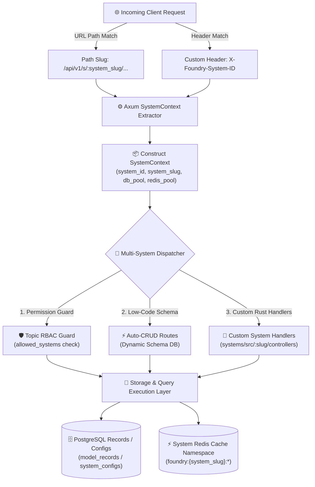

---

### 3.2 Dynamic Schema Engine & Zero-DDL Storage Architecture

Database capability is a native, zero-boilerplate foundational engine in Foundry. Developers and administrators **never need to write repetitive CRUD controllers or manual SQL queries**.

#### 3.2.1 Enterprise Production Reality: Zero-DDL Architecture
In enterprise production environments, applications operate under strict DBA governance:
- **No Runtime DDL Permissions**: Application database users are strictly restricted to DML operations (`SELECT`, `INSERT`, `UPDATE`, `DELETE`). DDL (`CREATE TABLE`, `ALTER TABLE`) is prohibited to eliminate metadata locks, connection exhaustion, and accidental schema destruction.
- **One-Time Initialization**: All platform tables are deployed once via standard pre-audited DDL script ([`migrations/init.sql`](file:///home/panhy/src/foundkit/foundry/migrations/init.sql)).
- **Zero-DDL Runtime Agility**: Administrators and developers can create unlimited sub-systems, models, and custom fields in the Admin UI without running any database DDL or requiring DBA intervention.

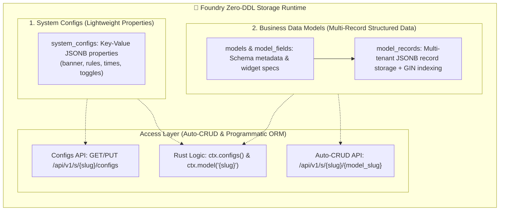

---

#### 3.2.2 Decoupled Architecture: System Configs vs. Business Data Models

Foundry completely separates lightweight topic configurations from multi-record business data entities:

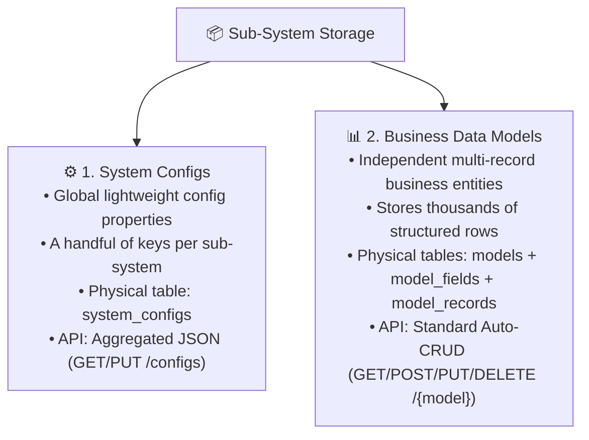

##### 1. System Configs
- **Use Case**: Global parameters for a campaign/sub-system (e.g. Campaign Title, Banner Image URL, Event Time Range, Share Text, RichText Rules, Switch Flags).
- **Physical Storage**: Stored in `system_configs` (`system_id`, `key`, `label`, `value_type`, `value: JSONB`, `options`, `sort_order`).
- **Clean Aggregation**: The backend aggregates all configs into a single key-value JSON response on `GET /api/v1/s/{slug}/configs`.
- **Visual Form UI (No Raw JSON Editors)**: The Admin UI renders dedicated visual widgets according to `value_type` and `options` (Image Uploader, DatePicker, Switch, RichText, Array Repeater).

##### 2. Business Data Models
- **Use Case**: Entities requiring multiple structured records (e.g., Product Catalog, Article List, Custom Submissions, Operation Logs).
- **Physical Storage**:
  - `models`: Model registry & permissions.
  - `model_fields`: Field specifications, data types, and form widget configuration.
  - `model_records`: Record rows stored with `data: JSONB` and PostgreSQL GIN inverted indexing.
- **Query Capabilities**: Full RESTful Auto-CRUD with pagination, multi-field filtering (`filter[field][op]=val`), multi-column sorting, keyword search, and GIN index scans.

---

#### 3.2.3 Comprehensive Field & Config Type Matrix

Both System Configs and Data Models support a rich set of first-class field types:

| Field Type | Storage Representation | Visual Form Widget in Admin UI | Validation & Features |
| :--- | :--- | :--- | :--- |
| **`string`** (Single-line text) | JSON string (`"title"`) | Standard `<Input />` box | Min/max length, regex pattern, trim |
| **`richtext`** (Rich Text / HTML)| JSON string (`"<p>...</p>"`) | WYSIWYG Editor (TipTap / Quill) | Sanitization, embedded image upload |
| **`image`** (Single image) | CDN URL string (`"https://..."`) | Image Uploader with preview & crop | Direct Qiniu/OSS/S3/Local upload |
| **`file`** (Media attachment) | Asset URL / Object | File Dropzone & Progress bar | MIME type filter, size limit |
| **`integer`** (Integer) | JSON integer (`42`) | Stepper `<InputNumber />` | Range constraints (`min`, `max`), step |
| **`number`** / **`float`** | JSON number (`99.50`) | Decimal Precision Input | Float precision, currency format |
| **`boolean`** (Boolean toggle) | JSON boolean (`true`/`false`)| Toggle `<Switch />` | Default state, active/inactive labels |
| **`datetime`** / **`date`** | ISO-8601 string / Timestamp | Calendar & Time Picker | Timezone formatting, future/past rules |
| **`array`** (Dynamic list/array) | JSON array (`[...]`) | **Dynamic Visual Repeater List** | Array of strings, images, or sub-objects with `+ Add Item` & drag-and-drop sorting |
| **`relation`** (Model relationship) | Foreign ID / Array of IDs | Searchable Select / Modal picker | 1:1, 1:N relations to Data models |

> [!IMPORTANT]
> **No Raw JSON UX Rule**: Operators and content managers NEVER edit raw JSON strings. Every field—even complex arrays or image galleries—is managed via purpose-built visual components. The system handles the serialization to/from JSON transparently.

---

#### 3.2.4 Dual-Mode Access API & Programmatic Rust Abstractions

##### 1. RESTful HTTP Endpoints
- **Data Models (Multi-Record Collection)**:
  - `GET /api/v1/s/{system_slug}/{model_slug}` (Paginated list with filter & sort)
  - `POST /api/v1/s/{system_slug}/{model_slug}` (Create record with schema validation)
  - `GET /api/v1/s/{system_slug}/{model_slug}/:id` (Get record by ID)
  - `PUT/PATCH /api/v1/s/{system_slug}/{model_slug}/:id` (Update record)
  - `DELETE /api/v1/s/{system_slug}/{model_slug}/:id` (Soft/hard delete)
- **System Configs (Aggregated Settings)**:
  - `GET /api/v1/s/{system_slug}/configs` (Get aggregated configuration JSON)
  - `PUT /api/v1/s/{system_slug}/configs` (Update multiple configuration values with validation)

##### 2. Programmatic Access in Custom Rust Logic (`systems/src/<slug>/logic/`)
```rust
// 1. Working with Data Models
let product_model = ctx.model("products")?;
let product = product_model.find_one()
    .where_eq("id", product_id)
    .where_gt("stock", 0)
    .execute(&ctx.db)
    .await?;

product_model.update_by_id(product_id)
    .decrement("stock", 1)
    .execute(&ctx.db)
    .await?;

// 2. Working with System Configs
#[derive(Deserialize, Serialize)]
pub struct SubsystemSettings {
    pub banner_image: String,
    pub is_active: bool,
    pub support_email: String,
}

// Strongly-typed retrieval into Rust structs
let config: SubsystemSettings = ctx.configs().get().await?;

// Or raw JSON value retrieval
let banner = ctx.configs().get_string("banner_image").await?;
```

---

### 3.3 Admin IAM, Three-Tier RBAC & Non-GET Audit Logging

Foundry implements an enterprise-grade administrative identity and audit system focused on security, tenant boundary enforcement, and complete state mutation tracking.

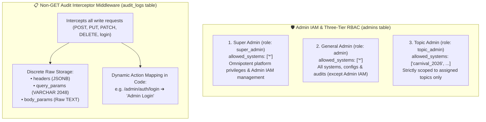

#### 3.3.1 Admin IAM & Three-Tier Role Authorization Matrix

1. **Unified Admin Identity (`admins` Table)**:
   - All management operations in Foundry are executed by administrators registered in the `admins` table.
   - Passwords are encrypted using high-security **Argon2id**.
   - Sessions are authenticated via signed JWT bearer tokens with embedded `admin_id`, `role`, and `allowed_systems` claims.

2. **Three-Tier Roles & Permissions Matrix**:

   | Role | Role Code | Platform Dashboard | Platform Summary API | Subsystems Management | Admins & IAM Management | Platform Audit Logs | Subsystem Workspaces |
   | :--- | :--- | :--- | :--- | :--- | :--- | :--- | :--- |
   | **超级管理员** (Super Admin) | `super_admin` | Full view | Yes (`200 OK`) | Full (List all, Create, Edit) | Full (`/admin/admins`) | Full (All global logs) | Full (All subsystems) |
   | **普通管理员** (General Admin) | `admin` | Full view | Yes (`200 OK`) | Full (List all, Create, Edit) | **Forbidden (`403`)** | Full (All global logs) | Full (All subsystems) |
   | **专题管理员** (Topic Admin) | `topic_admin` | Partial view (No global stats) | **Forbidden (`403`)** | Scoped (List assigned topics only; no create/edit) | **Forbidden (`403`)** | **Forbidden (`403`)** (Scoped to topics only) | Scoped (Assigned topics only) |

3. **Multi-Layer Permission Enforcement**:
   - **Frontend Level**: Role-based menu rendering, button visibility toggling, and client-side route guards in `App.tsx` and `Layout.tsx`.
   - **Backend API & Middleware Level**: Real endpoint protection rejecting unauthorized calls with standard `403 Forbidden` JSON envelopes:
     - `/api/v1/admin/admins`: Requires `super_admin` (`claims.can_manage_admins()`).
     - `/api/v1/admin/platform/summary`: Restricted to `super_admin` and `admin` (`claims.can_view_platform_summary()`).
     - `/api/v1/admin/systems` (POST / PUT): Restricted to `super_admin` and `admin` (`claims.has_platform_manage_access()`).
     - `/api/v1/admin/systems` (GET): Automatically scopes database query to `claims.allowed_systems` for `topic_admin`.
     - `/api/v1/admin/audit-logs`: Rejects global queries from `topic_admin` unless filtered by authorized `system_slug`.
     - `/api/v1/admin/s/{system_slug}/*`: Enforced via `require_topic_access` middleware and `check_system_access`.

4. **RBAC Middleware Evaluation Flow**:
   ```rust
   pub fn check_system_access(claims: &AdminClaims, target_system_slug: &str) -> AppResult<()> {
       // Super Admin and General Admin have platform-wide access
       if claims.role == "super_admin" || claims.role == "admin" {
           return Ok(());
       }

       // Topic Admin can only access explicitly assigned sub-systems
       if claims
           .allowed_systems
           .iter()
           .any(|s| s == "*" || s == target_system_slug)
       {
           return Ok(());
       }

       Err(AppError::Forbidden(format!(
           "Administrator '{}' is not authorized to manage sub-system '{}'",
           claims.username, target_system_slug
       )))
   }
   ```

---

#### 3.3.2 Non-GET Operation Audit Logging (`audit_logs`)

To guarantee strict compliance, security forensics, and operational traceability, Foundry implements a dedicated **Non-GET Audit Logging Middleware**:

1. **Selective Interception Strategy**:
   - **GET Requests**: Excluded from audit storage to avoid database bloating from read traffic.
   - **Non-GET Requests**: Every `POST`, `PUT`, `PATCH`, `DELETE` request (and authentication endpoints like `/admin/auth/login`) is captured and persisted.

2. **Discrete & Raw Parameter Storage Model (`audit_logs`)**:
   Standard HTTP requests contain three distinct parameter dimensions. To accommodate non-JSON bodies (form-urlencoded, raw text, XML, etc.) and preserve original URL query strings without lossy transformations, query parameters and request bodies are stored in their **raw original text format**:

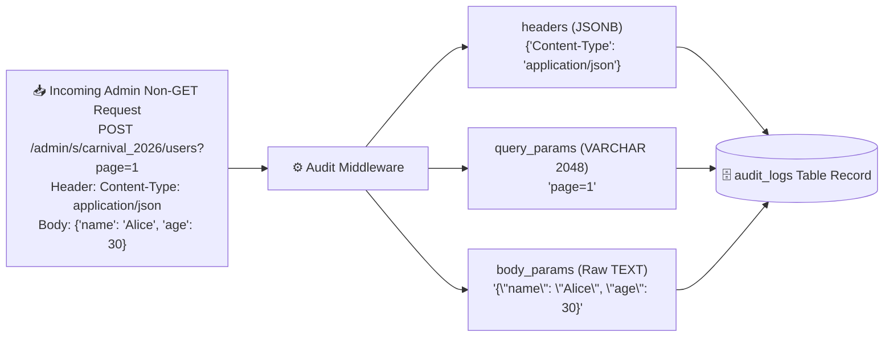

   - `admin_id`: UUID of the acting administrator (nullable for login attempts prior to authentication).
   - `admin_username`: Username snapshot (`VARCHAR(48)`) for rapid rendering without repetitive joins.
   - `system_slug`: Target sub-system slug (`VARCHAR(32)`, NULL for global actions like admin management).
   - `method`: HTTP method (`VARCHAR(10)`, e.g., `POST`, `PUT`, `DELETE`).
   - `path`: Exact endpoint path (`VARCHAR(255)`, e.g., `/admin/s/carnival_2026/configs`).
   - `action_name`: Human-readable action description (`VARCHAR(64)`) resolved dynamically in application code.
   - `headers`: JSONB key-value map of request headers (e.g., `Content-Type`, `X-Request-ID`, with token sanitization).
   - `query_params`: Raw query string as sent by the client (`VARCHAR(2048)`), providing ample buffer while preventing memory abuse.
   - `body_params`: Raw request body content stored as `TEXT` without mandatory JSON parsing, safely preserving JSON, form-data, plain text, XML, and other formats.
   - `ip_address` & `user_agent`: Client network and browser metadata (`VARCHAR(45)` for IPv6, `VARCHAR(512)` for User-Agent).
   - `status_code` & `duration_ms`: Execution result code (`SMALLINT`) and latency in milliseconds (`INTEGER`).

3. **Dynamic Action Name Mapping in Application Code**:
   Rather than hardcoding rigid database ENUMs, the application uses a flexible route-matching registry that maps URL patterns and methods to human-readable names:
   ```rust
   pub fn resolve_action_name(method: &Method, path: &str) -> &'static str {
       match (method.as_str(), path) {
           ("POST", p) if p.ends_with("/auth/login") => "Admin Login",
           ("POST", p) if p.ends_with("/auth/logout") => "Admin Logout",
           ("POST", "/admin/admins") => "Create Admin",
           ("PUT", p) if p.starts_with("/admin/admins/") => "Update Admin",
           ("POST", "/admin/systems") => "Create Sub-System",
           ("PUT", p) if p.contains("/configs") => "Update System Configs",
           ("POST", p) if p.contains("/models") => "Create Data Model",
           ("DELETE", p) if p.contains("/records/") => "Delete Record",
           _ => "Business Write Operation",
       }
   }
   ```

---

#### 3.3.3 Sub-System Autonomy & Client Authentication Model

A core architectural principle of Foundry in the infrastructure phase is **Sub-System Domain Autonomy**:
- **No Pre-Packaged End-User Tables**: Foundry does NOT prescribe or enforce a platform-wide end-user database (`system_users` or unified login).
- **Sub-System Specific Needs**: Different sub-systems have vastly different user requirements (WeChat OpenID login, SMS OTP, OAuth2, anonymous guest sessions, or pure internal tools).
- **Self-Contained Implementation**: When a sub-system requires client user login or domain entities (e.g. membership profiles, order ledgers), it designs and maintains those models directly within its own sub-system workspace (`systems/src/<slug>/`) or dynamic models.

---

### 3.4 Sub-System Code-First Custom Extensibility Architecture

In addition to dynamic Low-Code models (Auto-CRUD), Foundry provides first-class support for **Code-First Sub-System Extension**. Developers can write custom controllers and domain business logic in native Rust under a dedicated sub-system directory.

#### 3.4.1 Three-Layer Architectural Pattern per Sub-System
Each sub-system located in `systems/src/<system_slug>/` strictly adheres to a standard Three-Layer Architecture:

```
systems/src/<system_slug>/
├── mod.rs                  # [Entry & Registration] Implements SubsystemModule trait
├── controllers/            # [Layer 1: HTTP Presentation / API Controller]
│   ├── mod.rs              # Route assembly & sub-router export
│   └── custom_controller.rs # Axum Handlers, parameter extraction, OpenAPI annotations
├── logic/                  # [Layer 2: Domain Business Logic & Services]
│   ├── mod.rs              # Service exports & domain rules
│   └── custom_service.rs   # Core business rules, database transactions & custom workflows
└── dto/                    # [Layer 3: Data Transfer Objects & Validation]
    ├── mod.rs              # Request/Response structs, validator schemas
    └── custom_dto.rs       # Strongly typed payloads, serde deserialization, custom validation rules
```

1. **Controller Layer (`controllers/`)**:
   - **Responsibility**: HTTP protocol handling, URL path/query/JSON body parsing, parameter validation (`validator`), invoking the Logic Layer, and returning standard JSON response envelopes.
   - **OpenAPI Integration**: Annotated with `#[utoipa::path(...)]` for compile-time generation of OpenAPI documentation.
   - **Rule**: Controllers MUST NOT contain business logic or direct raw SQL queries; they delegate all orchestration to the Logic Layer.

2. **Logic / Service Layer (`logic/`)**:
   - **Responsibility**: Pure business domain logic, transactional state transitions, and custom domain orchestration.
   - **Access to Storage**: Leverages dynamic schema ORM (`ctx.model(...)`, `ctx.configs()`) or direct SQL connections scoped to the current `SystemContext`.
   - **Rule**: Framework-agnostic (independent of Axum HTTP types), easily unit-testable.

3. **DTO Layer (`dto/`)**:
   - **Responsibility**: Defines request inputs and response payloads with serde serialization/deserialization, default values, and declarative validation constraints (`#[validate(range(min = 1, max = 100))]`).

#### 3.4.2 `SubsystemModule` Trait & Custom Route Auto-Mounting
Foundry defines a standard Rust trait in `crates/foundry_core` that every sub-system implements:

```rust
// In crates/foundry_core/src/subsystem.rs
pub trait SubsystemModule: Send + Sync + 'static {
    /// Returns the unique slug of the sub-system (e.g. "carnival_2026")
    fn slug(&self) -> &'static str;
    
    /// Human-readable display name of the sub-system
    fn display_name(&self) -> &'static str;
    
    /// Mounts custom HTTP routes under the sub-system's scope
    /// Routes mounted here are accessible at `/api/v1/s/{slug}/...`
    fn register_routes(&self, router: axum::Router<SystemContext>) -> axum::Router<SystemContext>;
    
    /// Registers sub-system OpenAPI schemas & paths into the global Utoipa registry
    fn register_openapi(&self, openapi: &mut utoipa::openapi::OpenApi);
}
```

#### 3.4.3 Unified Dependency Injection & Context Extraction
Custom controllers receive the `SystemContext` automatically injected by Axum middleware:

```rust
// Example Controller Handler in systems/src/carnival_2026/controllers/custom_controller.rs
#[utoipa::path(
    post,
    path = "/api/v1/s/carnival_2026/participate",
    request_body = ParticipateRequest,
    responses(
        (status = 200, description = "Participation successful", body = ParticipateResponse),
        (status = 400, description = "Invalid request payload")
    ),
    tag = "System: carnival_2026"
)]
pub async fn handle_participate(
    State(ctx): State<SystemContext>,
    Json(payload): Json<ParticipateRequest>,
) -> Result<Json<ApiResponse<ParticipateResponse>>, AppError> {
    // 1. Validate incoming payload
    payload.validate()?;
    
    // 2. Delegate to Business Logic Layer
    let result = CarnivalService::participate(&ctx, payload).await?;
    
    // 3. Return standardized API response
    Ok(Json(ApiResponse::success(result)))
}
```

#### 3.4.4 Seamless Route Composition: Dynamic Auto-CRUD + Custom APIs
When a request arrives at `/api/v1/s/{system_slug}/*`, the `foundry_engine` router matches:
1. **Custom Sub-System Routes**: If a custom controller is registered in `systems/src/{system_slug}/controllers/` for that path, it handles the request with highest priority.
2. **Dynamic Auto-CRUD Routes**: If no custom endpoint matches, the engine checks dynamic schema models defined in the visual Admin UI (e.g. `/api/v1/s/{system_slug}/products`).
3. **404 Not Found Envelope**: If neither matches, returns a standard localized 404 error envelope.

#### 3.4.5 CLI Scaffolding Workflow
The Developer CLI (`apps/cli`) provides automated scaffolding for new sub-systems and endpoints:
```bash
# 1. Create a brand new sub-system code module with unique slug
foundry-cli system new <system_slug> --name "Marketing Carnival 2026"

# 2. Add a new controller to an existing sub-system
foundry-cli system add controller <system_slug> <controller_name>

# 3. Add a new logic service to an existing sub-system
foundry-cli system add logic <system_slug> <service_name>
```

---

### 3.5 Hybrid Extension Architecture (Rust Hooks + Wasmtime Sandbox)

Foundry enables runtime and non-compiled customization through two complementary extension mechanisms:

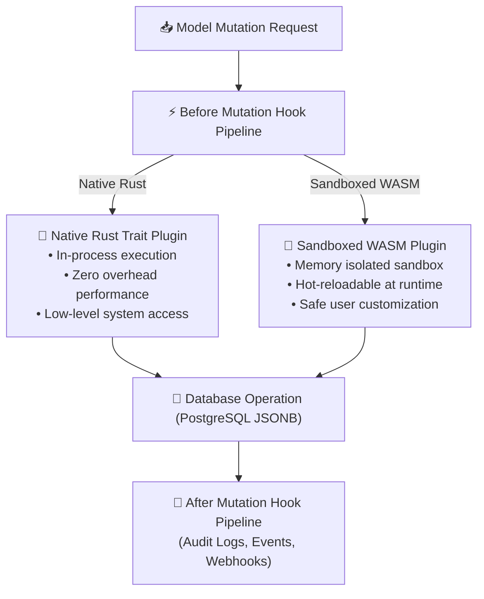

1. **Native Rust Mutation Hooks**: In-process hooks (`before_create`, `after_update`, etc.) executing around database mutations for sub-systems.
2. **Wasmtime Sandboxed Plugins**: Allows runtime dynamic execution of sandboxed `.wasm` modules (written in Rust, Go, AssemblyScript, or C) with zero engine recompilation.

---

### 3.6 End-to-End Localization (i18n) Architecture

Foundry supports complete internationalization across all layers:

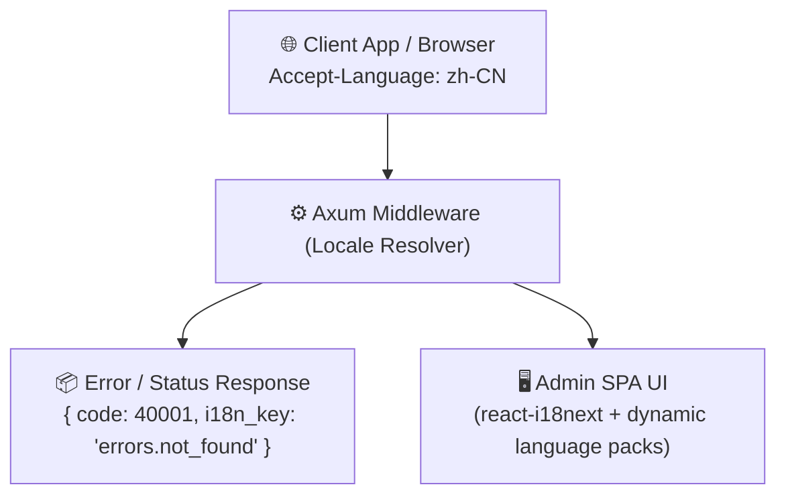

- **Frontend i18n (`apps/admin/src/locales` + `react-i18next`)**: Embedded modular translation files (`en-US.json`, `zh-CN.json`, `ja-JP.json`), dynamic locale bundle loader, and translation verification tools.
- **Backend Error Envelopes**: Errors return standardized JSON envelopes containing machine-readable error codes and localization keys:
  ```json
  {
    "code": 40001,
    "message": "Resource not found",
    "i18n_key": "errors.resource_not_found",
    "args": { "resource": "products" }
  }
  ```
- **Backend Formatting (`fluent-rs`)**: Rust backend utilizes Mozilla Fluent (`fluent-rs`) for handling complex pluralizations, variable interpolations, and notification templates.

---

### 3.7 Web Admin Architecture: Platform Control Plane, Subsystem Workspaces & URL Route Persistence

To maintain strict domain autonomy and clean separation of concerns, Foundry's visual Web Admin Panel is architected into two decoupled tiers:

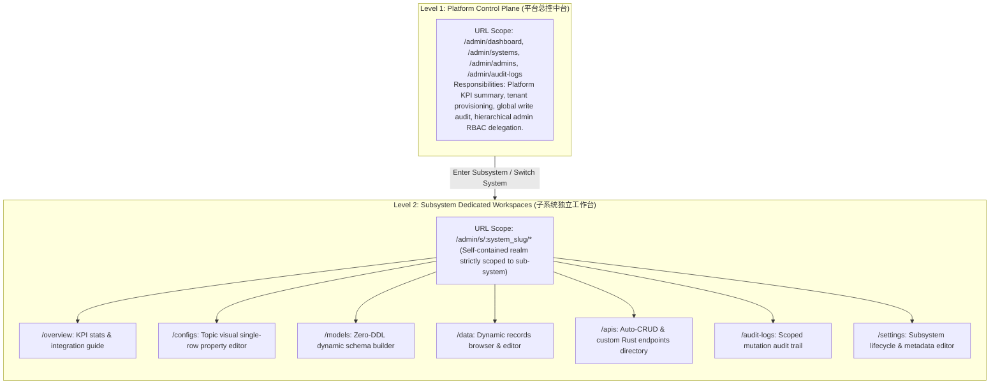

#### 3.7.1 Bidirectional URL Routing & State Persistence
All admin state in Foundry is **explicitly synchronized with the browser location bar**:
- **Full Path Explicit Sync**: Every view corresponds to an explicit URL (e.g. `/admin/s/carnival_2026/models`).
- **Query & Pagination Parameters**: Search criteria, active model selections, and pagination parameters are serialized into URL query parameters:
  - Subsystems search: `/admin/systems?page=1&page_size=10&keyword=carnival&status=1`
  - Data records explorer: `/admin/s/carnival_2026/data?model=products&page=2&page_size=15`
  - Dynamic models schema: `/admin/s/carnival_2026/models?model=products`
  - Audit trail: `/admin/audit-logs?page=1&method=POST`
- **History Navigation & Bookmarking**: Operators can refresh, bookmark, or share any link, and the entire workspace state (active subsystem, selected model, page number, filters) is faithfully restored.

#### 3.7.2 Multi-Attribute Sub-System Search & Real-Time Stats
Sub-systems management features high-performance database-backed filtering:
1. **Multi-Dimension Search**:
   - `id`: Exact/partial UUID query
   - `slug`: Subsystem unique identifier matching
   - `name`: Fuzzy display name search
   - `keyword`: Cross-field search over slug, name, and description
   - `status`: Active (`1`) vs. Disabled (`0`) filter
2. **Enriched Live Subsystem Statistics**:
   The backend aggregates live statistical counters directly into the paginated sub-system query:
   - `models_count`: Total data models created in the sub-system
   - `configs_count`: Total single-row properties configured
   - `records_count`: Total dynamic data rows stored
3. **Platform-Wide Summary Metric API**:
   Super Admins and General Admins have access to `/api/v1/admin/platform/summary`, delivering real-time platform metrics (total systems, active systems, total models, total records, total admins, total mutation logs). Topic Admins are strictly restricted from global platform metrics.

#### 3.7.3 Streamlined Navigation Hierarchy & Role-Aware UX

To reduce cognitive load and establish intuitive workflows, the Web Admin UI adopts a clean, focused navigation model:
1. **Removed Redundant Quick Switchers**:
   - Eliminated top header dropdown switchers in both platform and subsystem modes.
   - Removed the duplicate "Active Sub-Systems" quick list at the bottom of the left sidebar.
   - Navigation into sub-systems is conducted cleanly via the **"专题/子系统管理"** (`/admin/systems`) console list or Dashboard workspace cards.
2. **Role-Aware Dynamic Navigation Rendering**:
   - **Super Admin**: Full access to Platform Overview, Sub-Systems Management, Mutation Audit Trail, and Admin IAM.
   - **General Admin**: Full platform access (Overview, Sub-Systems, Audits) with Admin IAM automatically hidden.
   - **Topic Admin**: Tailored workspace view displaying only authorized sub-systems, hiding platform-wide audit logs and admin delegation menus.

---

## 4. Client Integration & API Contract Strategy

### 4.1 REST-First Philosophy & "Zero-SDK" Autonomy
A fundamental architectural tenet of Foundry is **REST-First and Zero-SDK Autonomy**:
1. **Self-Contained RESTful APIs**: All Foundry features (Dynamic CRUD, System Configs, Sub-System Custom APIs) are exposed as clean, predictable, standard HTTP RESTful endpoints.
2. **Zero Vendor Lock-In**: Client applications (Web, iOS, Android, Desktop, Mini-Programs, Backend Microservices) **do not require an official SDK** to integrate with Foundry. Any standard HTTP client (`fetch`, `axios`, `Ktor`, `Retrofit`, `cURL`, `reqwest`) can directly consume the APIs.
3. **Core Repository Decoupling**: Client SDKs do not belong to the Foundry core repository. Keeping the core monorepo strictly focused on engine services, admin UI, and CLI ensures maximum architectural clarity, minimal CI maintenance overhead, and language neutrality.

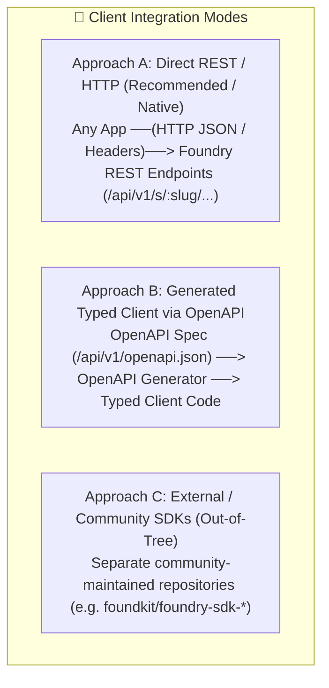

### 4.2 OpenAPI-Native Integration & Type Generation

Foundry provides compile-time generated, real-time OpenAPI 3.0 specifications via `utoipa`:
- **Live Specification Endpoint**: The Foundry core server automatically exposes an up-to-date OpenAPI schema at `/api/v1/openapi.json` and interactive docs at `/api/v1/docs`.
- **Client Code Generation Workflow**:
  - Developers can feed `/api/v1/openapi.json` directly into standard code generators (e.g., `openapi-generator-cli`, `orval`, `hey-api`, or `kmp-openapi`) to produce typed clients on-demand for any language or framework (TypeScript, Kotlin, Swift, Go, Python, Dart/Flutter).
  - This eliminates client-server contract drift while completely removing the need for manual SDK maintenance inside the core system.

### 4.3 Unified Core Release Train & Versioning Model

Foundry adopts a **Synchronous Core Release Train** for all first-party components maintained in the monorepo:

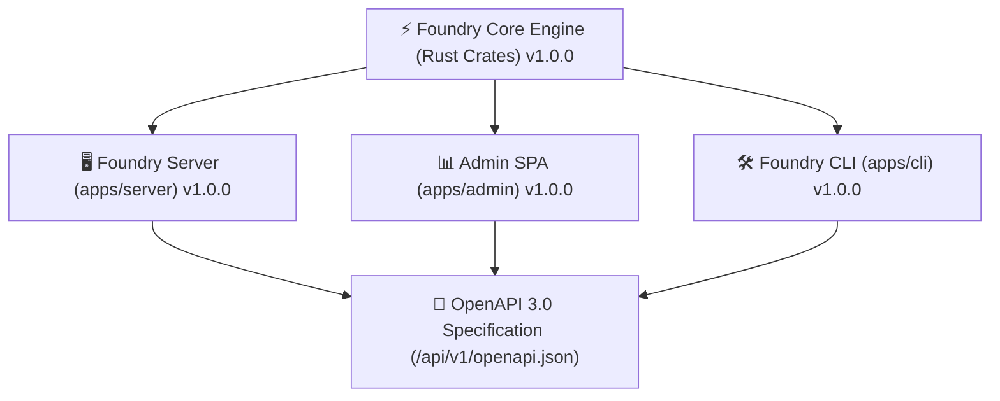

1. **Version Parity**:
   - All core applications (`apps/server`, `apps/admin`, `apps/cli`) share identical version tags `vX.Y.Z`.
   - The OpenAPI specification version strictly reflects the corresponding server version.
2. **Semantic Versioning Specification (SemVer 2.0.0)**:
   - **Major (`X.0.0`)**: Breaking changes to RESTful API structures or major engine architectural shifts.
   - **Minor (`X.Y.0`)**: New backward-compatible sub-system features, new platform primitives, or non-breaking API additions.
   - **Patch (`X.Y.Z`)**: Backward-compatible bug fixes, security patches, and performance optimizations.

---

## 5. Technology Stack Reference Matrix

| Layer | Technology Choice | Description / Rationale |
| :--- | :--- | :--- |
| **Monorepo Manager** | Cargo Workspaces + npm / pnpm | Dual setup managing Rust workspace crates, `systems/` custom packages, & `apps/admin` |
| **Backend Language & Runtime** | Rust (2024 Edition / 1.85+) + Tokio Async | Maximum performance, low memory footprint, zero-cost abstractions |
| **HTTP Web Framework** | Axum 0.8+ | High-performance, ergonomic routing, modular middleware architecture |
| **Subsystem Code Modularization** | `SubsystemModule` Trait + `systems/src/*` | Modular controller, logic, and DTO layers scoped per unique `system_slug` |
| **Validation & Serialization** | `validator` + `serde` / `serde_json` | Declarative request payload validation and high-performance serialization |
| **Primary Database & ORM** | PostgreSQL 18.6+ & SQLx | Dynamic JSONB, Zero-DDL storage, GIN indexing, ACID transactions |
| **Cache & Distributed State** | Redis 8+ | Tenant-namespaced caching, distributed locking, rate limiting |
| **Backend i18n & Localization**| `fluent-rs` / `unic-langid` | Mozilla Fluent format for localized error envelopes & templates |
| **Extension Engine** | Wasmtime (WebAssembly Runtime) | Sandboxed dynamic plugin execution without engine recompilation |
| **OpenAPI & API Contract** | Utoipa + Swagger UI | Rust compile-time OpenAPI 3.0 generation for both Auto-CRUD & Custom Controllers |
| **Admin Frontend SPA** | React 18+ / 19 / TypeScript 5+ / Vite 6+ / Tailwind CSS | Modern, accessible, responsive component-driven interface |
| **Frontend i18n Engine** | `react-i18next` + `i18next-browser-languagedetector` | Namespace-based translations with community pack hot-reloading |
| **API Client Tooling** | OpenAPI 3.0 (`openapi-generator`, `orval`, `hey-api`) | Type-safe client code generation without in-repo SDK lock-in |

---

## 6. Security, IAM & Isolation Model

1. **Strict Tenant Boundaries**: Axum middleware enforces `SystemContext` extraction before any handler is executed. All database operations and cache keys are strictly scoped to the active tenant.
2. **Admin IAM & Topic-Scoped RBAC**:
   - Super Admin (`super_admin`) holds universal permissions (`["*"]`) to manage the platform and grant permissions.
   - Normal Admins (`admin`) are constrained to specific sub-systems (`allowed_systems`).
3. **Non-GET Request Audit Trail**: Every write operation (POST, PUT, PATCH, DELETE, login) executed by administrators is automatically captured with operator identity, path, dynamic action name, parameters, IP, status, and latency.
4. **Fine-Grained Model Access Control**: Each dynamic model has visual granular toggles (`Public Read`, `Authenticated Read`, `Public Write`, `Private`). Role permissions are evaluated at the middleware level.
5. **Sandboxed Plugin Safety**: Dynamic WASM extensions run in an isolated memory space via `wasmtime` with zero access to the host filesystem or network unless explicitly whitelisted.

---

## 7. Operational & Deployment Architecture

- **Single Container Deployment**: A multi-stage `Dockerfile` compiles the Rust server binary and builds the Admin SPA assets into a single lightweight container image (under 50MB runtime footprint).
- **Embedded Asset Serving**: In self-hosted single-binary mode, the Axum server embeds the Admin SPA static assets directly, allowing users to run the entire platform with one binary and one command.
- **External Dependencies**: Requires only PostgreSQL (18.6+) and Redis (8+), easily orchestrated via `docker-compose.yml`.
