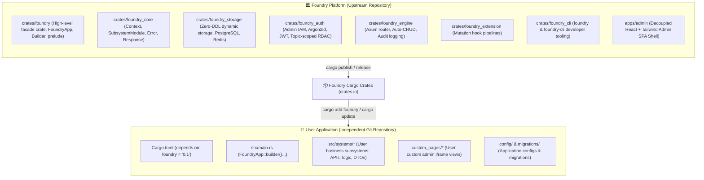
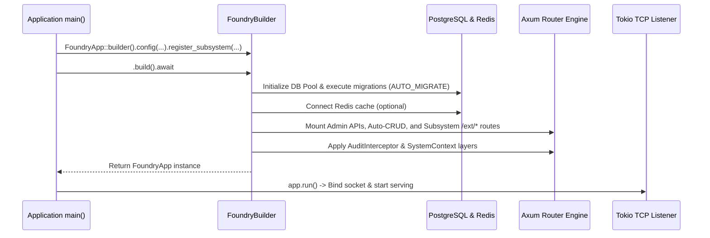

# Foundry Architecture Blueprint

> **Organization**: [foundkit](https://github.com/foundkit)  
> **Project**: `foundry`  
> **Positioning**: *A modern, modular, decoupled Rust backend platform and application framework.*

---

## 1. Core Architecture Vision

Foundry is designed from the ground up as a **reusable, versioned Rust Framework & Platform** distributed via Cargo packages.

Application developers do **not** fork or clone the Foundry repository to build business applications. Instead, application developers create completely independent Git repositories and consume Foundry as a standard Cargo dependency:



---

## 2. Responsibilities Separation

| Dimension | Foundry Platform / Framework | User Application |
|---|---|---|
| **Runtime & HTTP** | Axum server engine, TCP listener, graceful shutdown, CORS | Port/host binding configuration, endpoint consumption |
| **Routing** | Unified `/api/v1` tree, Admin APIs, Auto-CRUD, `/ext/*` subsystem mounting | Custom route handlers, middleware integration |
| **Storage Engine** | PostgreSQL connection pool, Redis cache namespace isolation, Zero-DDL dynamic model schema | Business entity definitions, custom domain queries |
| **Authentication & RBAC** | Argon2id hashing, JWT validation, Super/Platform/Topic Admin role verification | User domain auth logic, topic assignment |
| **Admin Control Plane** | React Admin Shell SPA, model explorer, config forms, iframe sandbox bridge | Custom subsystem operational views (HTML, React, Vue) |
| **Extensibility** | `SubsystemModule` trait, `MutationHook` lifecycle pipeline | Custom business subsystems, domain event listeners |
| **Developer Tooling** | `foundry` CLI (`new`, `system new`, `migrate`, `admin`) | Application project scripts, business migrations |

---

## 3. Subsystem Standard

A **Subsystem** in Foundry is a cohesive unit of business capabilities. Subsystems implement the `SubsystemModule` trait:

```rust
use axum::Router;
use foundry::prelude::*;

pub struct BlogSubsystem;

impl SubsystemModule for BlogSubsystem {
    fn slug(&self) -> &'static str {
        "blog"
    }

    fn display_name(&self) -> &'static str {
        "Content Management & Blog"
    }

    fn description(&self) -> &'static str {
        "Articles, publishing workflow, and audience engagement"
    }

    fn register_routes(&self, router: Router) -> Router {
        // Mounts custom handlers under /api/v1/s/blog/ext/*
        router.merge(controllers::build_routes())
    }

    fn custom_admin_pages(&self) -> Vec<CustomAdminPageSpec> {
        vec![
            CustomAdminPageSpec {
                key: "article_editor".to_string(),
                title: "Article Studio".to_string(),
                icon: "FileEdit".to_string(),
                page_type: "iframe".to_string(),
                entry: "/api/v1/s/blog/ext/custom-pages/article_editor.html".to_string(),
                required_role: None,
            }
        ]
    }
}
```

---

## 4. Application Bootstrap Pipeline

Foundry provides a fluent `FoundryApp::builder()` API:



---

## 5. Admin UI Decoupling & Bridge Protocol

The **Foundry Admin Shell** (`apps/admin`) is built with React and Tailwind CSS. It communicates with custom subsystem pages through the **FoundryBridge** postMessage protocol:

1. The Admin Shell loads the custom page inside an `<iframe>`.
2. When the iframe finishes loading, the shell dispatches a `FOUNDRY_INIT` message:
   ```json
   {
     "type": "FOUNDRY_INIT",
     "payload": {
       "token": "eyJhbGciOi...",
       "subsystemSlug": "blog",
       "admin": { "username": "admin", "role": "super_admin" },
       "theme": "dark"
     }
   }
   ```
3. The custom page receives authentication credentials and theme tokens without needing custom login forms or cross-origin hacks.

---

## 6. Versioning and Upgrade Strategy

Foundry follows **Semantic Versioning (SemVer)**:

- **Patch Releases (`0.1.1` -> `0.1.2`)**: Backward-compatible bug fixes and internal performance enhancements.
- **Minor Releases (`0.1.0` -> `0.2.0`)**: New features, new builders, backward-compatible trait extensions.
- **Major Releases (`1.0.0` -> `2.0.0`)**: Breaking API changes with structured migration guides.

To upgrade Foundry in a user application:
```bash
cargo update -p foundry
```
No upstream repository merge conflicts, rebasing, or monorepo entanglement.
