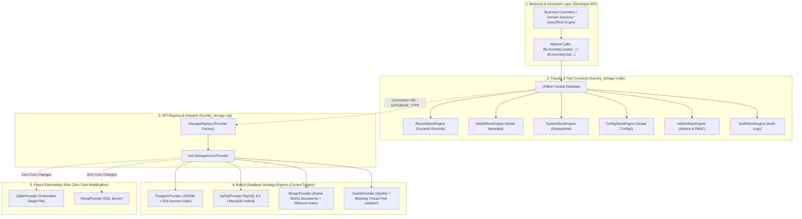

# Foundry Multi-Database & Pluggable Storage Architecture
# (Architecture Design & Implementation Roadmap)

> **Target Versions**: `v0.2.0` ~ `v0.3.0`  
> **Core Objective**: Decouple the current hardcoded PostgreSQL binding by introducing an **SPI (Service Provider Interface) pluggable mechanism** and **Strategy Pattern**. Encapsulate raw drivers completely, expose clean method-based domain interfaces, support automatic database selection via a single environment variable or connection URL, and progressively support **MySQL/MariaDB**, **MongoDB**, and **Oracle**.  
> **Support Matrix**:
> - **Currently Supported**: PostgreSQL (14+)
> - **Priority 0 (P0 - Immediate)**: MySQL (8.0+) / MariaDB (10.5+) — The most widely used open-source relational databases
> - **Priority 1 (P1 - Secondary)**: MongoDB (6.0+) — Native document database, zero-schema dynamic records natural fit
> - **Priority 2 (P2 - Enterprise)**: Oracle (19c/21c/23ai) — Large commercial enterprise & financial systems
> - **Future Extensible Slots**: SQLite (embedded / single-file / unit tests), SQL Server (MSSQL), TiDB, etc.

---

## 📌 Status Legend
- [ ] **Pending**
- [/] **In Progress**
- [x] **Completed**

---

## 🧭 1. Core Architectural Philosophy & Four Principles

### 1. Method-Based & Driver-Agnostic
- Business subsystems, the AutoCRUD engine, domain services, and developer code **only invoke unified standard methods** (e.g., `db.records().create(...)`, `db.records().list(...)`, `db.configs().get(...)`).
- Never expose `sqlx::PgPool`, `sqlx::MySqlPool`, or database-specific connection types directly in business layers.
- The framework completely encapsulates lower-level SQL dialects and network driver peculiarities.

### 2. Database-Native Strategy (Reject "Lowest Common Denominator SQL")
- Different databases possess fundamentally different physical architectures and strengths. Forcing a generic SQL template degrades performance and wastes platform advantages:
  - **PostgreSQL**: Leverages `JSONB` + `USING GIN(data)` inverted indexes + partial indexes for genuine Zero-DDL dynamic storage.
  - **MySQL / MariaDB**: Unified driver (99% code reuse). Overcomes the absence of full-JSON GIN inverted indexes by combining "Standard JSON column + Virtual Generated Columns + Secondary B-Tree Indexes".
  - **MongoDB**: Leverages native document capabilities to store schema-free BSON documents, naturally supporting massive dynamic records with Wildcard Indexes (`$**`) for arbitrary query acceleration.
  - **Oracle**: Leverages `IDENTITY` auto-increment and native JSON retrieval, isolating synchronous C-bindings (ODPI-C) into a dedicated blocking thread pool without blocking the async Tokio runtime.

### 3. Smart Protocol Auto-Detection & Single Environment Variable Selection
- **Out-of-the-Box Zero Redundancy**: The engine automatically detects the connection protocol from `DATABASE_URL`:
  - `postgres://` or `postgresql://` $\rightarrow$ activates PostgreSQL engine
  - `mysql://` or `mariadb://` $\rightarrow$ activates MySQL engine
  - `mongodb://` or `mongodb+srv://` $\rightarrow$ activates MongoDB native document engine
  - `oracle://` or `thin://` $\rightarrow$ activates Oracle enterprise engine
- **Explicit Override Supported**: Users can also configure a single environment variable (e.g., `DATABASE_TYPE=mysql` or `DATABASE_TYPE=mongodb`) during installation or deployment.
- **Provider-Managed Migrations**: Each engine implements a `run_migrations()` contract, automatically loading and running dialect-specific DDL scripts and distributed locks based on the chosen database.

### 4. Modular Cargo Feature Flags (Avoid Dependency Bloat)
- Rust is a statically compiled language. C-bindings (like Oracle ODPI-C) and heavy drivers (like MongoDB) increase binary size and can cause cross-compilation friction.
- Storage engines are gated behind Cargo Feature Flags:
  - `default = ["postgres"]`
  - Optional features: `features = ["mysql"]`, `features = ["mongodb"]`, `features = ["oracle"]`
  - If a user configures a database whose driver feature was not compiled in, the runtime halts with a clear and actionable error message.

---

## 🏗️ 2. Target Architecture Overview



---

## 📁 3. Refactored Crate Layout & Directory Structure

The standardized layout for `crates/foundry_storage`:

```text
crates/foundry_storage/
├── Cargo.toml                         # Feature flags (postgres, mysql, mongodb, oracle, sqlite)
├── migrations/                        # Dialect-specific migrations and baseline scripts
│   ├── postgres/                      # PostgreSQL DDL (BIGSERIAL, JSONB, GIN, PL/pgSQL)
│   │   └── init.sql
│   ├── mysql/                         # MySQL & MariaDB DDL (AUTO_INCREMENT, JSON, composite indexes)
│   │   └── init.sql
│   └── oracle/                        # Oracle DDL (IDENTITY, TIMESTAMP WITH TIME ZONE)
│       └── init.sql
└── src/
    ├── lib.rs                         # Re-exports Database facade and all store traits
    ├── facade.rs                      # Database struct and unified builder / connect API
    ├── entities.rs                    # Common domain entities (System, Model, Record, Admin, AuditLog)
    ├── traits/                        # Business Trait contracts
    │   ├── mod.rs
    │   ├── records.rs                 # RecordStoreEngine: list, get_by_id, create, update, delete
    │   ├── models.rs                  # ModelStoreEngine: list_models, get_model, create_model...
    │   ├── systems.rs                 # SystemStoreEngine: list, get_by_slug, stats...
    │   ├── configs.rs                 # ConfigStoreEngine: list, get_aggregated, update...
    │   ├── admins.rs                  # AdminStoreEngine: list, get_by_username, create...
    │   └── audit.rs                   # AuditStoreEngine: insert, list...
    ├── spi/                           # SPI discovery and driver registration
    │   ├── mod.rs
    │   ├── provider.rs                # StorageDriverProvider trait definition
    │   └── registry.rs                # StorageRegistry: driver registration & URL resolution
    └── engines/                       # Database-native strategy implementations
        ├── mod.rs
        ├── postgres/                  # PostgreSQL strategy
        │   ├── mod.rs
        │   ├── provider.rs            # PostgresProvider
        │   ├── records.rs             # GIN index & JSONB query handling
        │   └── stores.rs              # models, systems, admins implementations
        ├── mysql/                     # MySQL & MariaDB strategy (99% reuse)
        │   ├── mod.rs
        │   ├── provider.rs            # MySqlProvider
        │   ├── records.rs             # MySQL JSON operations, last_insert_id re-fetch
        │   └── stores.rs              # models, systems, admins implementations
        ├── mongodb/                   # MongoDB native document strategy
        │   ├── mod.rs
        │   ├── provider.rs            # MongoProvider
        │   ├── records.rs             # Native BSON CRUD & Wildcard index handling
        │   ├── counters.rs            # Atomic sequence counters for i64 ID compatibility
        │   └── stores.rs              # Collections implementations
        └── oracle/                    # Oracle enterprise strategy
            ├── mod.rs
            ├── provider.rs            # OracleProvider
            ├── records.rs             # Oracle JSON & dialect queries
            └── worker.rs              # tokio::task::spawn_blocking worker pool wrapper
```

---

## 🧩 4. Core Trait & Interface Contracts

### 1. `StorageDriverProvider` (SPI Extension Contract)

```rust
#[async_trait]
pub trait StorageDriverProvider: Send + Sync {
    /// Driver identifier, e.g. "postgres", "mysql", "mariadb", "mongodb", "oracle", "sqlite"
    fn driver_name(&self) -> &'static str;

    /// Evaluates if connection URL is handled by this provider (e.g. starts_with("mysql://"))
    fn supports(&self, connection_url: &str) -> bool;

    /// Connects to database and initializes all storage engines
    async fn create_engines(
        &self,
        connection_url: &str,
        max_connections: u32,
    ) -> AppResult<StorageEngineSet>;

    /// Executes dialect-specific migration scripts
    async fn run_migrations(&self, connection_url: &str) -> AppResult<()>;
}
```

### 2. `RecordStoreEngine` (Unified Dynamic Record Contract)

```rust
#[async_trait]
pub trait RecordStoreEngine: Send + Sync {
    async fn list(
        &self,
        system_slug: &str,
        model_slug: &str,
        query: RecordQuery,
    ) -> AppResult<PaginatedData<ModelRecordEntity>>;

    async fn get_by_id(
        &self,
        system_slug: &str,
        model_slug: &str,
        id: i64,
    ) -> AppResult<ModelRecordEntity>;

    async fn create(
        &self,
        system_slug: &str,
        model_slug: &str,
        data: serde_json::Value,
    ) -> AppResult<ModelRecordEntity>;

    async fn update(
        &self,
        system_slug: &str,
        model_slug: &str,
        id: i64,
        data: serde_json::Value,
    ) -> AppResult<ModelRecordEntity>;

    async fn delete(
        &self,
        system_slug: &str,
        model_slug: &str,
        id: i64,
    ) -> AppResult<()>;
}
```

### 3. `Database` (Unified Facade for Developers)

```rust
#[derive(Clone)]
pub struct Database {
    records: Arc<dyn RecordStoreEngine>,
    models: Arc<dyn ModelStoreEngine>,
    systems: Arc<dyn SystemStoreEngine>,
    configs: Arc<dyn ConfigStoreEngine>,
    admins: Arc<dyn AdminStoreEngine>,
    audit: Arc<dyn AuditStoreEngine>,
}

impl Database {
    /// Automatically connects to the matched driver based on DATABASE_URL and DATABASE_TYPE
    pub async fn connect(url: &str, max_connections: u32, auto_migrate: bool) -> AppResult<Self>;

    pub fn records(&self) -> &dyn RecordStoreEngine { self.records.as_ref() }
    pub fn models(&self) -> &dyn ModelStoreEngine { self.models.as_ref() }
    pub fn systems(&self) -> &dyn SystemStoreEngine { self.systems.as_ref() }
    pub fn configs(&self) -> &dyn ConfigStoreEngine { self.configs.as_ref() }
    pub fn admins(&self) -> &dyn AdminStoreEngine { self.admins.as_ref() }
    pub fn audit(&self) -> &dyn AuditStoreEngine { self.audit.as_ref() }
}
```

---

## 🎯 5. Database-Native Strategy Details

### 1. PostgreSQL Strategy
- **Schema**: `model_records` table, with `data JSONB NOT NULL DEFAULT '{}'::jsonb`.
- **Indexes**:
  - `CREATE INDEX idx_lookup ON model_records(system_id, model_slug, created_at DESC) WHERE deleted_at IS NULL;` (Partial index for quick lookup)
  - `CREATE INDEX idx_data_gin ON model_records USING GIN(data);` (Full inverted index for arbitrary JSON fields)
- **SQL Dialect**: `$1, $2` parameters; writes use `INSERT ... RETURNING *` in a single round-trip.

### 2. MySQL & MariaDB Unified Strategy (Priority 0 - Universal Single-Table JSON Engine)

#### A. Architectural Decision: Universal Single-Table vs Dynamic Physical Tables
For MySQL, we adopt a **Universal Single-Table JSON Engine (`model_records`)** and firmly **reject** the pattern of creating dynamic physical tables per model:
- **Why Reject "Physical Tables Per Model"?**
  - Executing `CREATE TABLE` / `ALTER TABLE` at runtime triggers MySQL's global Metadata Locks (MDL), blocking connection pools under concurrency.
  - Multi-tenant environments with hundreds of models cause `.ibd` file descriptor exhaustion, InnoDB table cache overflow, and crash risks.
  - Violates Foundry's foundational "Zero-DDL instant setup" philosophy.
- **Advantages of Universal Single-Table Storage**:
  - **Genuine Zero-DDL**: Creating a model inserts one row into `models`; data mutations touch only `model_records`, fully transactional with zero schema locks.
  - **Operational Simplicity**: Only one `model_records` table to manage, backup, replicate, and optimize across the platform.

#### B. Schema Design: Differentiating Models via Compact `model_id` Integer
To avoid the index bloat of composite string tuples `(system_id, model_slug)`, the MySQL table is optimized as follows:

```sql
CREATE TABLE IF NOT EXISTS model_records (
    id BIGINT NOT NULL AUTO_INCREMENT PRIMARY KEY,
    model_id BIGINT NOT NULL,                     -- Primary discriminator: references models(id) integer FK
    system_id VARCHAR(32) NOT NULL,               -- Tenant / Subsystem identifier for lifecycle isolation
    model_slug VARCHAR(48) NOT NULL,              -- Redundant slug to eliminate join overhead
    data JSON NOT NULL,                           -- Core dynamic payload: all key business fields stored in native JSON
    created_at DATETIME(6) NOT NULL DEFAULT CURRENT_TIMESTAMP(6),
    updated_at DATETIME(6) NOT NULL DEFAULT CURRENT_TIMESTAMP(6) ON UPDATE CURRENT_TIMESTAMP(6),
    deleted_at DATETIME(6) NULL,
    -- Core covering index: compact integer prefix covers 99% of model pagination queries
    INDEX idx_model_query (model_id, deleted_at, created_at DESC, id DESC),
    INDEX idx_system_query (system_id, deleted_at)
) ENGINE=InnoDB DEFAULT CHARSET=utf8mb4 COLLATE=utf8mb4_unicode_ci;
```

> **Index Memory Compaction Analysis**:  
> `model_id: BIGINT` consumes only **8 bytes**, compared to `(system_id VARCHAR(32), model_slug VARCHAR(48))` (which takes up to 320 bytes in utf8mb4), achieving over **75% index size reduction**!  
> In InnoDB, compact secondary indexes allow each B+ Tree leaf page to store 4x more entries, reducing tree height and ensuring near-100% InnoDB Buffer Pool cache hits.

#### C. Four-Tier Performance Optimization Matrix for JSON Storage

To address MySQL 8.0's lack of GIN inverted indexes, the driver implements a four-tier optimization matrix:

1. **Covering Index & Deferred Join Pagination**:
   - Traditional deep pagination (`LIMIT 10000, 20`) performs poorly when parsing large JSON blobs per scanned row.
   - The driver utilizes **Deferred Joins**: scanning the lightweight `idx_model_query` covering index first to retrieve pagination `id`s, then joining back to fetch the JSON payload:
     ```sql
     SELECT r.id, r.model_id, r.system_id, r.model_slug, r.data, r.created_at, r.updated_at
     FROM (
         SELECT id FROM model_records
         WHERE model_id = ? AND deleted_at IS NULL
         ORDER BY created_at DESC, id DESC
         LIMIT ? OFFSET ?
     ) AS p
     JOIN model_records r ON r.id = p.id;
     ```
   - Reduces deep pagination query latency from hundreds of milliseconds to 1–3 ms.

2. **Virtual Generated Columns + Secondary B-Tree Indexes for Filter Keys**:
   - When a property in `model_fields` is flagged for frequent filtering, uniqueness, or sorting (e.g., `price`, `status`, `user_id`), the driver can attach a MySQL Virtual Generated Column on demand:
     ```sql
     -- Virtual columns consume zero physical disk storage and compute on the fly
     ALTER TABLE model_records ADD COLUMN v_price DECIMAL(10,2)
     GENERATED ALWAYS AS (data->>'$.price') VIRTUAL;
     
     CREATE INDEX idx_records_model_price ON model_records(model_id, v_price);
     ```
   - This delivers native physical column B-Tree index query performance while preserving the Zero-DDL model.

3. **Atomic Re-Query within Short Transaction (Solving Missing `RETURNING`)**:
   - Because MySQL 8.0 lacks `INSERT ... RETURNING`, the driver wraps `INSERT` $\rightarrow$ `res.last_insert_id()` $\rightarrow$ `SELECT` by primary key within a single fast transaction, preventing race conditions.

4. **Native Hash Partitioning for Multi-Million Row Datasets**:
   - For high-volume multi-tenant deployments exceeding tens of millions of rows, the table supports native MySQL partitioning:
     ```sql
     PARTITION BY HASH(model_id) PARTITIONS 16;
     ```
   - Partitions data evenly across 16 sub-tables while maintaining automatic **Partition Pruning**, ensuring individual partition indexes fit comfortably in RAM.

### 3. MongoDB Native Document Strategy (Priority 1)
- **Document Mapping**:
  - `model_records` maps directly to native MongoDB collections:
    ```json
    {
      "_id": ObjectId("6651a..."),
      "id": 100001,
      "system_id": "carnival_2026",
      "model_slug": "products",
      "data": { "title": "Mechanical Keyboard", "price": 99, "tags": ["hardware"] },
      "created_at": ISODate("2026-09-26T12:00:00Z"),
      "updated_at": ISODate("2026-09-26T12:00:00Z"),
      "deleted_at": null
    }
    ```
- **ID Compatibility**: Uses atomic counters in a `_counters` collection or Snowflake integer generation to satisfy the public `id: i64` contract transparently.
- **Native Dynamic Indexing**: MongoDB Wildcard Index (`data.$**`) natively indexes arbitrary nested JSON properties without any DDL migrations.
- **Full Async Runtime**: Official `mongodb` crate with full Tokio async compatibility.

### 4. Oracle Enterprise Strategy (Priority 2)
- **Dialect Adaptations**:
  - Primary Key: `id NUMBER(19) GENERATED ALWAYS AS IDENTITY PRIMARY KEY`.
  - Timestamps: `TIMESTAMP WITH TIME ZONE`.
  - JSON Storage: `CLOB CHECK (data IS JSON)` on Oracle 19c; native binary `JSON` on Oracle 21c/23ai.
  - Indexes: Oracle Text `CREATE SEARCH INDEX idx_data_search ON model_records(data) FOR JSON;`.
- **Blocking Call Isolation**:
  - `rust-oracle` relies on ODPI-C dynamic libraries, which perform blocking synchronous I/O.
  - `engines/oracle/worker.rs` delegates all operations to dedicated blocking threads using `tokio::task::spawn_blocking`, protecting Axum's async runtime from thread starvation.

---

## 🔮 6. Future Extensibility Example: Adding SQLite

Adding a new database engine requires **zero modifications to core code**:

1. **Step 1**: Implement `StorageDriverProvider` in `engines/sqlite/provider.rs`:
   ```rust
   pub struct SqliteProvider;
   #[async_trait]
   impl StorageDriverProvider for SqliteProvider {
       fn driver_name(&self) -> &'static str { "sqlite" }
       fn supports(&self, url: &str) -> bool { url.starts_with("sqlite://") }
       async fn create_engines(&self, url: &str, _) -> AppResult<StorageEngineSet> {
           let pool = sqlx::SqlitePool::connect(url).await?;
           Ok(StorageEngineSet {
               records: Arc::new(SqliteRecordEngine { pool: pool.clone() }),
               // ...
           })
       }
       async fn run_migrations(&self, url: &str) -> AppResult<()> { ... }
   }
   ```
2. **Step 2**: Register the provider:
   ```rust
   registry.register(Box::new(SqliteProvider));
   ```
3. **Step 3**: Configure `DATABASE_URL=sqlite://foundry.db`. The application immediately runs on SQLite!

---

## 📅 7. Phased Implementation Roadmap

```
[Phase 0: Core SPI & Trait Contracts] ➔ [Phase 1: MySQL & MariaDB Support (P0)]
                                                         │
[Phase 4: Production-Readiness & Release] ⬅ [Phase 3: Oracle Engine (P2)] ⬅ [Phase 2: MongoDB Engine (P1)]
```

### Phase 0: Core SPI Architecture & Trait Abstraction (Foundation)
- [ ] **0.1 Standard Domain Store Traits**: Define standard traits in `crates/foundry_storage/src/traits/` (`RecordStoreEngine`, `ModelStoreEngine`, `SystemStoreEngine`, `ConfigStoreEngine`, `AdminStoreEngine`, `AuditStoreEngine`).
- [ ] **0.2 SPI Registry**: Define `StorageDriverProvider` and `StorageRegistry` in `crates/foundry_storage/src/spi/`.
- [ ] **0.3 Unified Database Facade & Protocol Sniffing**: Implement `Database` facade, supporting automatic URL scheme sniffing (`postgres://`, `mysql://`, `mongodb://`, `oracle://`) with `DATABASE_TYPE` override support.
- [ ] **0.4 Cargo Feature Modularization**: Configure `Cargo.toml` with feature flags (`postgres`, `mysql`, `mongodb`, `oracle`).
- [ ] **0.5 PostgreSQL Provider Extraction**:
  - Extract existing hardcoded PG logic into `engines/postgres/` and implement `PostgresProvider`.
  - Refactor `foundry_engine::AppState` and `FoundryApp::builder()` to consume `Database`.
  - Execute automated tests to guarantee 100% backward compatibility for PostgreSQL.

### Phase 1: MySQL & MariaDB Support (P0 Priority - Universal Single-Table JSON Engine)
- [ ] **1.1 Universal Single-Table Migrations**: Write `migrations/mysql/init.sql`, implementing single-table storage with compact integer `model_id: BIGINT` as the primary index prefix in `model_records` (`AUTO_INCREMENT`, `DATETIME(6)`, native `JSON`, and composite covering indexes).
- [ ] **1.2 Connection Management**: Implement `engines/mysql/` module using `sqlx::MySqlPool`.
- [ ] **1.3 MySQL RecordStoreEngine High-Performance Implementation**:
  - Implement **Covering Index & Deferred Join Pagination**: scan lightweight index for IDs first, then join back to fetch full JSON, eliminating deep pagination bottlenecks.
  - Resolve the lack of `RETURNING` (`INSERT` $\rightarrow$ `last_insert_id()` $\rightarrow$ `SELECT` in atomic transaction).
  - Implement on-demand Virtual Generated Columns with B-Tree indexes for hot query/filter keys.
- [ ] **1.4 Metadata Stores**: Implement MySQL stores for `models`, `systems`, `configs`, `admins`, and `audit_logs`.
- [ ] **1.5 Container & End-to-End Testing**:
  - Add MySQL 8.0 service to `dev/docker-compose.yml`.
  - Add CI integration tests verifying AutoCRUD, admin authentication, dynamic records, and configs under MySQL.

### Phase 2: MongoDB Native Document Engine Support (P1 Priority)
- [ ] **2.1 Driver Integration**: Introduce official `mongodb` async driver under `features = ["mongodb"]`.
- [ ] **2.2 BSON Document Mapping & ID Strategy**:
  - Implement two-way serialization between BSON Documents and `ModelRecordEntity`.
  - Introduce `_counters` collection or Snowflake algorithm to maintain public `id: i64` contract.
- [ ] **2.3 Dynamic Indexing**: Utilize MongoDB Wildcard Indexes (`$**`) for zero-maintenance JSON query indexing.
- [ ] **2.4 Platform Collections**: Implement MongoDB document stores for `systems`, `models`, `configs`, `admins`, and `audit_logs`.
- [ ] **2.5 Container & Integration Testing**: Configure MongoDB 7.0 in Docker Compose and verify zero-schema storage and pagination.

### Phase 3: Oracle Enterprise Engine & Blocking Isolation (P2 Priority)
- [ ] **3.1 Dependency Configuration**: Introduce `oracle` crate and connection pooling under `features = ["oracle"]`.
- [ ] **3.2 Dialect Migrations**: Write `migrations/oracle/init.sql` (`NUMBER(19) GENERATED ALWAYS AS IDENTITY`, `TIMESTAMP WITH TIME ZONE`, Oracle JSON search indexes).
- [ ] **3.3 Async Isolation Worker Pool**: Implement `engines/oracle/worker.rs` with `tokio::task::spawn_blocking` to isolate ODPI-C blocking operations from the Axum async runtime.
- [ ] **3.4 Dockerfile with Oracle Instant Client**: Provide Docker build definitions including required Oracle C runtime libraries.
- [ ] **3.5 Oracle Integration Testing**: Verify model creation, CRUD, and transaction operations on Oracle.

### Phase 4: Production-Readiness, CLI Tooling & Release
- [ ] **4.1 Smart CLI Migration Tooling**: Upgrade `foundry migrate` command to auto-detect target database and invoke the respective dialect migration runner.
- [ ] **4.2 Open-Closed Principle Verification**: Implement a unit test with a `MockDriverProvider` to demonstrate that external storage providers can be registered without modifying core code.
- [ ] **4.3 Multi-Database Deployment Guide**: Publish production configuration, connection pool tuning, and failover guides in docs.
- [ ] **4.4 Version Release**: Align milestone progress and tag the official Foundry multi-database release.
