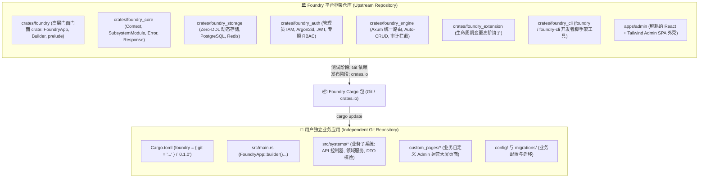
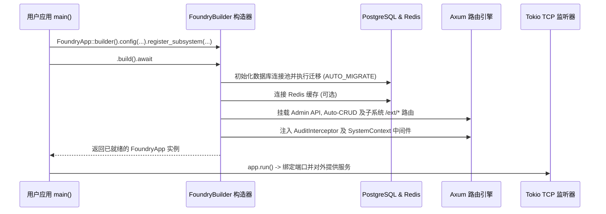

# Foundry 架构设计蓝图

> **组织**: [foundkit](https://github.com/foundkit)  
> **项目**: `foundry`  
> **定位**: *现代、模块化、完全解耦的 Rust 后端平台与应用开发框架。*

---

## 1. 核心架构定位

Foundry 从底层设计上明确为一个**可独立版本化、通过 Cargo 依赖分发的 Rust Framework / Platform**。

业务开发者**不需要** clone 或 fork Foundry 源码仓库，而是拥有自己完全独立的 Git 仓库，仅通过 Cargo dependency 引入 Foundry：



---

## 2. 职责边界划分

| 维度 | Foundry Platform / Framework 负责 | User Application 业务应用负责 |
|---|---|---|
| **运行时与网络** | Axum 服务引擎、TCP Listener、优雅停机、CORS、跟踪 | 端口/主机配置、实际业务流量接入 |
| **路由体系** | `/api/v1` 统一路由树、Admin API、Auto-CRUD、子系统 `/ext/*` 挂载 | 自定义业务路由处理函数、业务专属中间件 |
| **存储基础设施** | PostgreSQL 连接池管理、Redis 租户隔离缓存、Zero-DDL 动态模型引擎 | 业务数据模型定义、业务复杂事务与查询 |
| **身份与权限** | Argon2id 哈希、JWT 签发校验、三级 RBAC（超管/普通/专题管理员） | 业务域账号体系、专题管理员分配 |
| **Admin 控制台** | React Admin SPA 仪表盘、动态模型配置器、iframe 安全沙箱 Bridge | 自定义子系统运营大屏（HTML/React/Vue） |
| **扩展机制** | `SubsystemModule` 特征、`MutationHook` 变更拦截管道 | 业务子系统实现、领域事件监听 |
| **开发者工具** | `foundry` CLI（`new`, `system new`, `migrate`, `admin`） | 业务构建脚本、业务专属迁移文件 |

---

## 3. 子系统规范 (Subsystem Standard)

在 Foundry 体系中，**子系统 (Subsystem)** 是组织业务领域能力的基本单元。业务模块通过实现 `SubsystemModule` 特征与框架对接：

```rust
use axum::Router;
use foundry::prelude::*;

pub struct BlogSubsystem;

impl SubsystemModule for BlogSubsystem {
    fn slug(&self) -> &'static str {
        "blog"
    }

    fn display_name(&self) -> &'static str {
        "博客与内容发布系统"
    }

    fn description(&self) -> &'static str {
        "文章内容管理、发布工作流与订阅中心"
    }

    fn register_routes(&self, router: Router) -> Router {
        // 自定义路由挂载于 /api/v1/s/blog/ext/*
        router.merge(controllers::build_routes())
    }

    fn custom_admin_pages(&self) -> Vec<CustomAdminPageSpec> {
        vec![
            CustomAdminPageSpec {
                key: "article_editor".to_string(),
                title: "文章创作工作室".to_string(),
                icon: "FileEdit".to_string(),
                page_type: "iframe".to_string(),
                entry: "/api/v1/s/blog/ext/custom-pages/article_editor.html".to_string(),
                required_role: None,
            }
        ]
    }
}
```

---

## 4. 应用启动流

Foundry 提供了直观流畅的 `FoundryApp::builder()` 启动器 API：



---

## 5. Admin UI 完全解耦与 Bridge 通信协议

**Foundry Admin Shell** (`apps/admin`) 作为一个独立的 SPA 外壳，通过 **FoundryBridge** `postMessage` 协议与用户自定义大屏页面进行安全通信：

1. Admin Shell 在 iframe 内加载子系统自定义页面。
2. 页面加载完成后，外壳发送 `FOUNDRY_INIT` 消息：
   ```json
   {
     "type": "FOUNDRY_INIT",
     "payload": {
       "token": "eyJhbGciOi...",
       "subsystemSlug": "blog",
       "admin": { "username": "admin", "role": "super_admin" },
       "theme": "dark"
     }
   }
   ```
3. 自定义页面直接获取当前管理员凭据与主题配置，无需重复编写登录界面或侵入框架源码。

---

## 6. 版本管理与平滑升级策略

Foundry 严格遵循 **语义化版本 (SemVer)**：

- **补丁版本 (`0.1.1` -> `0.1.2`)**: 向后兼容的 Bug 修复与性能优化。
- **次版本 (`0.1.0` -> `0.2.0`)**: 新特性、新 Builder 选项、向后兼容的特征扩展。
- **主版本 (`1.0.0` -> `2.0.0`)**: 包含 Breaking Changes 的重大重构，并附带迁移指南。

升级框架时，用户只需在自身项目中执行：
```bash
cargo update -p foundry
```
完全避免了传统 fork 模式下的上游 Git 合并冲突。
