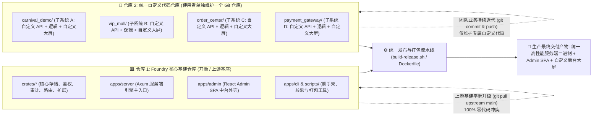
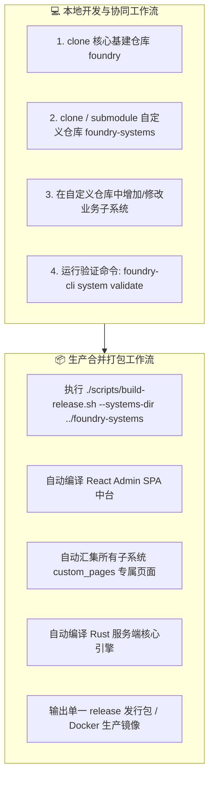
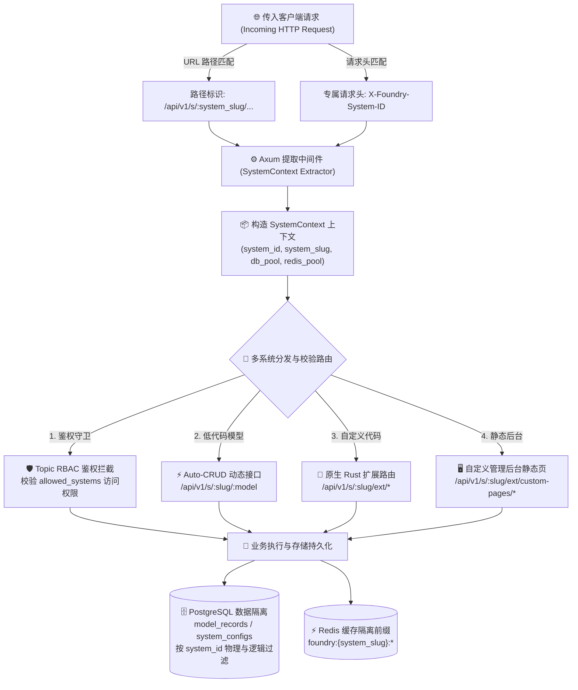

# Foundry 架构蓝图设计

> **组织**: [foundkit](https://github.com/foundkit)  
> **项目**: `foundry`  
> **核心愿景**: *基于统一基座构建与运行独立的多系统后端。*  
> **仓库描述**: *Foundry 是一个用于在共享基座上构建和运行多个独立后端系统与管理后台的开源基础设施平台。*

---

## 1. 产品定位与愿景

### 1.1 什么是 Foundry？
**Foundry** 是一个完整、自包含的开源 **多系统后端平台与管理系统**（Backend-as-a-Service / 多租户基础设施引擎）。

Foundry 采用 **“平台核心基建 + 统一自定义代码仓库”** 的双仓库彻底解耦架构：
- **基建仓库 (`foundry`)**：提供纯粹的基础设施能力（Axum 服务端引擎、PostgreSQL Zero-DDL 存储、Redis 租户隔离、管理员 IAM、操作审计日志、React Admin 中台外壳、构建发布工具）。
- **用户自定义仓库 (`foundry-custom` / `foundry-systems`)**：**仅需一个单独的代码仓库，存放用户或团队的所有子系统自定义代码**（所有自定义 API 接口 + 业务领域逻辑 + 自定义 Admin 后台大屏页面 + 清单配置）。



### 1.2 核心价值
1. **使用者仅需维护单一自定义仓库**：团队所有的业务子系统统一存放在一个独立的 Git 仓库中，每个子系统在该仓库下占据一个独立的目录。
2. **基建升级 0 冲突**：平台基座代码由 Foundry 开源团队持续维护演进。当核心基座发布新特性或安全补丁时，直接 `git pull upstream main` 即可升级，绝不与业务自定义代码产生任何 Git 合并冲突。
3. **自包含子系统规范 (Self-Contained Subsystem)**：单个子系统目录下完整聚合了其专属的自定义 API 控制器、业务逻辑服务、DTO 校验、自定义后台 UI 页面与元数据清单。
4. **多系统强隔离引擎**：在单个 Foundry 统一实例中同时运行与管理多个独立业务子系统，保持严格的租户、数据与缓存前缀隔离。
5. **可视化一键系统与模型生成 (Admin UI + Auto-CRUD)**：现代化管理面板，图形化创建子系统、定义动态数据模型，并自动生成高性能 RESTful API。
6. **分级管理员 IAM 与 Topic 范围 RBAC**：内置超级管理员（`super_admin`）与针对具体子系统授权的主题管理员（`admin` / `topic_admin`）。
7. **非 GET 写操作全量审计追踪**：自动记录所有非 GET 操作（POST、PUT、PATCH、DELETE、登录）的操作人、子系统、路径、负载、IP 及耗时。
8. **一键合并打包发布流水线**：单条构建脚本或多阶段 Docker 镜像打包，在打包阶段将基建底座与用户的统一自定义仓库无缝合并为一个高性能可执行产物。

---

## 2. 仓库目录结构与解耦规范

### 2.1 基建仓库 (`foundry`) 目录结构

```
foundry/                         # 基建核心仓库 (Open-Source / Upstream)
├── README.md                    # 项目概述与快速指南
├── docs/                        # Astro Starlight 文档站源码
│   ├── astro.config.mjs         # Starlight 配置文件
│   ├── package.json             # 文档依赖与构建脚本
│   └── src/content/docs/        # 多语言 Markdown 文档内容
├── migrations/                  # 数据库初始化与迁移
│   └── init.sql                 # 基线 PostgreSQL 表结构 (Zero-DDL 表)
├── apps/                        # 可执行应用程序
│   ├── server/                  # Foundry Core Server (Rust / Axum 后端服务入口)
│   ├── admin/                   # Visual Web Admin Dashboard SPA (React / Vite / Tailwind)
│   └── cli/                     # 开发者 CLI 工具 (子系统脚手架、代码生成、仓库验证)
├── crates/                      # 核心模块 Crates (Rust Workspace)
│   ├── foundry_core/            # SystemContext, SubsystemModule, CustomAdminPageSpec
│   ├── foundry_storage/         # 动态模型存储引擎、ORM 抽象 (SQLx)
│   ├── foundry_auth/            # 管理员 IAM、Argon2id、JWT 与 Topic RBAC
│   ├── foundry_engine/          # 多系统路由、Auto-CRUD 生成器、审计拦截器
│   └── foundry_extension/       # 变更钩子与 WASM 扩展流水线
├── systems/                     # 子系统挂载工作区 (可直接作为 Git Submodule 挂载用户的自定义仓库)
│   └── src/                     # 注册中心与各子系统模块
├── external_systems/            # 独立外部子系统挂载目录 (运行时动态扫描)
├── scripts/                     # 构建与打包脚本
│   └── build-release.sh         # 统一发布打包流水线 (支持 --systems-dir 参数合并自定义仓库)
└── docker/                      # 容器化部署
    ├── Dockerfile               # 生产环境多阶段自动合并构建
    └── docker-compose.yml       # 本地开发环境编排
```

---

### 2.2 用户统一自定义代码仓库 (`foundry-systems`) 目录结构

使用者或团队在内部单独维护一个 Git 仓库（如 `my-company-foundry-systems`），用于存放团队的所有自定义子系统：

```
foundry-systems/                 # 用户统一自定义代码仓库 (单一 Git 仓库)
├── Cargo.toml                   # 子系统工作区配置
├── README.md                    # 自定义业务说明文档
├── carnival_demo/               # 子系统 A: 营销抽奖活动 (目录完全自包含)
│   ├── mod.rs                   # 子系统入口与 SubsystemModule Trait 实现
│   ├── subsystem.json           # 子系统元数据与自定义管理页面声明
│   ├── controllers/             # 自定义 HTTP 控制器 (Axum Handlers)
│   ├── logic/                   # 自定义业务领域逻辑与事务服务
│   ├── dto/                     # 请求/响应 DTO 与参数校验约束
│   └── custom_pages/            # 自定义 Admin UI 管理后台页面 (HTML/JS/CSS)
│       ├── lottery_dashboard.html
│       └── wheel_control.html
├── vip_mall/                    # 子系统 B: VIP 商城与会员中心 (目录完全自包含)
│   ├── mod.rs
│   ├── subsystem.json
│   ├── controllers/
│   ├── logic/
│   ├── dto/
│   └── custom_pages/
│       └── overview.html
├── order_center/                # 子系统 C: 订单与结算系统 (目录完全自包含)
│   ├── mod.rs
│   ├── subsystem.json
│   ├── controllers/
│   ├── logic/
│   ├── dto/
│   └── custom_pages/
└── payment_gateway/             # 子系统 D: 支付聚合网关 (目录完全自包含)
    └── ...
```

---

## 3. 核心解耦架构与协同流转

### 3.1 为什么使用者只需要维护一个自定义仓库？

传统的插件或多系统架构往往存在两种极端：
1. **代码与基建强耦合在一起**：修改业务代码导致基座被污染，一旦上游开源平台更新，`git merge` 产生海量代码冲突。
2. **每个子系统各开一个仓库**：当团队拥有 10 个子系统时，需要维护 10 个不同的 Git 仓库，极易造成多仓库协同混乱、版本管理与权限治理困难。

**Foundry 的最佳实践方案**：
- **统一自定义仓库 (Single Custom Repo)**：团队所有的子系统集中在一个内部 Git 代码仓库中统一管理。
- **目录自包含 (Directory Self-Containment)**：在仓库内，每个子系统独立建目录，内部封装专属的 API、业务服务、DTO 与自定义管理大屏。
- **零侵入平台基座 (Zero Intrusion on Base)**：`foundry` 基座代码库保持纯粹通用性，不包含任何业务私有代码。
- **升级 0 冲突 (0-Conflict Upgrades)**：当 Foundry 基座升级时，使用者只需对 `foundry` 基建仓库执行 `git pull upstream main`（或拉取最新官方 Docker 基础镜像），业务自定义代码完全不受影响。



---

### 3.2 自包含子系统标准规范 (Self-Contained Subsystem Directory Standard)

每个子系统目录自包含以下五个核心维度：

1. **自定义 API 与路由层 (`controllers/`)**：
   - 编写 Axum 处理函数，挂载于 `/api/v1/s/{system_slug}/ext/*` 路径。
   - 接收自动注入的 `SystemContext`，支持 Utoipa 注解生成 OpenAPI 规范。
2. **领域业务服务层 (`logic/`)**：
   - 包含业务规则、事务处理、状态机流转。
   - 可调用 `ctx.model("{model_slug}")` 进行 Zero-DDL 存储操作，或调用 `ctx.configs()` 获取系统配置。
3. **数据契约与校验层 (`dto/`)**：
   - 使用 `serde` 进行反序列化，使用 `validator` 进行声明式字段校验（长度、正则、范围等）。
4. **自定义管理后台页面 (`custom_pages/`)**：
   - 存放子系统专属的管理操作大屏、可视化工具（HTML/JS/CSS 或独立 React/Vue 单页产物）。
   - 自动挂载至 `/api/v1/s/{system_slug}/ext/custom-pages/*`。
   - 通过 `window.addEventListener('message')` 接收来自 Foundry Admin 外壳注入的 JWT Token 与主题模式（`FoundryBridge`）。
5. **元数据清单 (`subsystem.json`)**：
   - 声明子系统的 `slug`、`display_name`、`version` 以及自定义管理页面的入口 URL 与权限要求（`required_role`）。

---

### 3.3 多租户子系统路由与唯一标识标准

每个子系统拥有两个核心标识：

1. **`system_id` (内部不可变 UUID)**：数据库主键与底层关联字段。
2. **`system_slug` (人类可读代码与 URL 标识)**：小写字母、数字与下划线（如 `carnival_demo`），用于：
   - 接口前缀：`/api/v1/s/{system_slug}/*`（Auto-CRUD）与 `/api/v1/s/{system_slug}/ext/*`（自定义扩展接口）
   - 自定义后台资源：`/api/v1/s/{system_slug}/ext/custom-pages/*`
   - Redis 缓存隔离前缀：`foundry:{system_slug}:*`
   - 代码目录映射与 OpenAPI 分组



---

### 3.4 三种本地开发与连接模式

| 开发连接模式 | 配置方法 | 优势与适用场景 |
| :--- | :--- | :--- |
| **模式 A: Git Submodule 模式 (推荐)** | 将 `foundry-systems` 仓库作为 Submodule 挂载到 `foundry/systems/` | 原生 Cargo Workspace 联合编译，IDE 跨仓库代码补全与跳转，极致运行性能 |
| **模式 B: 环境变量指定模式** | 设置 `export FOUNDRY_SYSTEMS_DIR=/path/to/foundry-systems` | 零侵入代码库，服务端启动时自动扫描该目录下的所有子系统与静态后台页面 |
| **模式 C: 软链接模式** | `ln -s /path/to/foundry-systems external_systems/my_systems` | 本地多仓库快速联动开发，修改即时生效 |

---

## 4. 统一发布与合并打包流水线

在持续集成（CI/CD）或发布生产版本时，通过单一构建脚本或 Docker 多阶段构建即可将基建代码与用户的统一自定义子系统仓库合并输出：

```bash
# 1. 运行一键打包脚本并指定自定义仓库路径
./scripts/build-release.sh --systems-dir /path/to/foundry-systems

# 2. 或使用 Docker 进行容器化打包
docker build -t foundry-app:latest -f docker/Dockerfile .
```

产物包含：
- **`bin/foundry-server`**：内嵌所有子系统的 Rust 核心服务二进制。
- **`bin/foundry-cli`**：管理与脚手架命令行工具。
- **`static/admin/`**：已编译构建的 React Admin SPA 中台。
- **`static/custom_pages/` & `external_systems/`**：各子系统的专属自定义后台页面与独立配置。
- **`migrations/`**：PostgreSQL 初始化脚本。
- **`start.sh`**：开箱即用的生产启动引导脚本。

