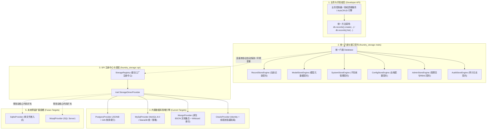

# Foundry 多数据库引擎与插件化存储架构设计与路线图
# (Multi-Database & Pluggable Storage Architecture)

> **版本定位**：`v0.2.0` ~ `v0.3.0`  
> **核心目标**：解耦当前单一 PostgreSQL 绑定，引入 **SPI (Service Provider Interface) 插件化机制** 与 **策略模式 (Strategy Pattern)**，实现底层驱动全面封装、上层纯方法调用，支持通过单一环境变量或连接串自动切换数据库，并分批次落地支持 **MySQL/MariaDB**、**MongoDB** 与 **Oracle**。  
> **支持矩阵**：
> - **当前已支持**：PostgreSQL (14+)
> - **首发重点支持 (P0)**：MySQL (8.0+) / MariaDB (10.5+) —— 最广泛使用的开源关系型数据库
> - **次阶段支持 (P1)**：MongoDB (6.0+) —— 原生文档型数据库，零 Schema 海量动态记录天然契合
> - **企业级特化 (P2)**：Oracle (19c/21c/23ai) —— 大型商业企业与金融政企级数据库
> - **未来预留扩展**：SQLite (嵌入式/单机/单元测试), SQL Server (MSSQL), TiDB 等

---

## 📌 状态图例
- [ ] **待开始 (Pending)**
- [/] **进行中 (In Progress)**
- [x] **已完成 (Completed)**

---

## 🧭 一、 核心设计哲学与四大原则

### 1. 面向纯方法调用，驱动零泄露 (Method-Based & Driver-Agnostic)
- 业务子系统、AutoCRUD 引擎、领域服务以及开发者代码**只调用统一标准方法**（例如 `db.records().create(...)`、`db.records().list(...)`、`db.configs().get(...)`）。
- 严禁在业务层直接暴露 `sqlx::PgPool`、`sqlx::MySqlPool` 或任何特定数据库的连接对象。
- 系统彻底屏蔽底层 SQL 方言细节与网络驱动差异。

### 2. 因地制宜的特化策略，拒绝“最低公倍数 SQL” (Database-Native Strategy)
- 不同的数据库具备截然不同的物理特性与优势，强求单一 SQL 模板会抹杀各数据库的独特优势：
  - **PostgreSQL**：利用 `JSONB` + `USING GIN(data)` 倒排索引 + 部分索引实现真正的极致 Zero-DDL。
  - **MySQL / MariaDB**：统一驱动（复用度 99%），针对无 GIN 倒排索引的物理限制，采用“标准 JSON 列 + 虚拟生成列 (Virtual Generated Columns) + 局部二级 B-Tree 索引”组合策略，兼顾无锁扩展与检索性能。
  - **MongoDB**：利用原生文档数据库本能，免 Schema 存储 BSON Document，天然适配海量动态记录，利用 Wildcard 索引 (`$**`) 实现任意深度的动态查询加速。
  - **Oracle**：采用 `IDENTITY` 自增与原生 JSON 支持，并通过专用工作线程池完成阻塞 C 驱动（ODPI-C）向异步 Tokio 运行时的无感隔离。

### 3. 智能协议探测 + 单一环境变量切换 (Smart URL Auto-Detection)
- **开箱即用，零冗余配置**：系统优先根据 `DATABASE_URL` 的协议前缀自动路由到对应数据库驱动：
  - `postgres://` 或 `postgresql://` $\rightarrow$ 自动激活 PostgreSQL 引擎
  - `mysql://` 或 `mariadb://` $\rightarrow$ 自动激活 MySQL 引擎
  - `mongodb://` 或 `mongodb+srv://` $\rightarrow$ 自动激活 MongoDB 原生文档引擎
  - `oracle://` 或 `thin://` $\rightarrow$ 自动激活 Oracle 企业引擎
- **支持显式指定**：用户在安装部署时，也可以通过单一环境变量（如 `DATABASE_TYPE=mysql` 或 `DATABASE_TYPE=mongodb`）显式指定数据库类型。
- **方言特化迁移生命周期**：各引擎实现 `run_migrations()` 契约，自动根据所选数据库类型加载并执行特化的初始化脚本与防重锁。

### 4. Cargo Feature 按需编译，杜绝依赖膨胀 (Conditional Compilation)
- Rust 是静态编译语言，Oracle C-binding (ODPI-C) 和 MongoDB 驱动体积较大且需要特化动态库链接。
- 为避免编译产物臃肿与跨平台编译失败，所有驱动全部采用 Cargo Feature Flags 进行解耦：
  - `default = ["postgres"]`
  - 可选特性：`features = ["mysql"]`, `features = ["mongodb"]`, `features = ["oracle"]`
  - 如果用户配置了未启用的数据库驱动，启动阶段会给出清爽明确的配置指引与报错拦截。

---

## 🏗️ 二、 目标系统架构全景



---

## 📁 三、 目录与代码工程重构规范

重构后 `crates/foundry_storage` 模块的规范布局：

```text
crates/foundry_storage/
├── Cargo.toml                         # Feature Flags 控制 (postgres, mysql, mongodb, oracle, sqlite)
├── migrations/                        # 各引擎特化的全量初始化与方言迁移脚本
│   ├── postgres/                      # PostgreSQL 方言脚本 (BIGSERIAL, JSONB, GIN, PL/pgSQL)
│   │   └── init.sql
│   ├── mysql/                         # MySQL & MariaDB 方言脚本 (AUTO_INCREMENT, JSON, 复合索引)
│   │   └── init.sql
│   └── oracle/                        # Oracle 方言脚本 (IDENTITY, TIMESTAMP WITH TIME ZONE)
│       └── init.sql
└── src/
    ├── lib.rs                         # 统一导出门面 Database 与全部业务 Store Traits
    ├── facade.rs                      # Database 结构体与统一 API 暴露
    ├── entities.rs                    # 通用实体模型 (System, Model, Record, Admin, AuditLog)
    ├── traits/                        # 【业务契约层】面向开发者的方法 Trait
    │   ├── mod.rs
    │   ├── records.rs                 # RecordStoreEngine: list, get_by_id, create, update, delete
    │   ├── models.rs                  # ModelStoreEngine: list_models, get_model, create_model...
    │   ├── systems.rs                 # SystemStoreEngine: list, get_by_slug, stats...
    │   ├── configs.rs                 # ConfigStoreEngine: list, get_aggregated, update...
    │   ├── admins.rs                  # AdminStoreEngine: list, get_by_username, create...
    │   └── audit.rs                   # AuditStoreEngine: insert, list...
    ├── spi/                           # 【SPI 扩展层】驱动发现与接入契约
    │   ├── mod.rs
    │   ├── provider.rs                # StorageDriverProvider trait 定义
    │   └── registry.rs                # StorageRegistry: 驱动注册与根据连接串查找
    └── engines/                       # 【具体策略实现层】各个数据库的特化方言与驱动实现
        ├── mod.rs
        ├── postgres/                  # PostgreSQL 引擎实现
        │   ├── mod.rs
        │   ├── provider.rs            # PostgresProvider
        │   ├── records.rs             # GIN 索引与 JSONB 操作
        │   └── stores.rs              # models, systems, admins 等实现
        ├── mysql/                     # MySQL & MariaDB 统一引擎 (99% 复用)
        │   ├── mod.rs
        │   ├── provider.rs            # MySqlProvider
        │   ├── records.rs             # MySQL JSON 操作、自增主键与无 RETURNING 处理
        │   └── stores.rs              # 各基础表实现
        ├── mongodb/                   # MongoDB 原生文档引擎
        │   ├── mod.rs
        │   ├── provider.rs            # MongoProvider
        │   ├── records.rs             # 原生 BSON 文档 CRUD 与 Wildcard 动态索引
        │   ├── counters.rs           # 保证外部 i64 主键兼容的原子计数器序列
        │   └── stores.rs              # 基础集合存储
        └── oracle/                    # Oracle 企业引擎
            ├── mod.rs
            ├── provider.rs            # OracleProvider
            ├── records.rs             # Oracle JSON 检索与方言
            └── worker.rs              # tokio::task::spawn_blocking 阻塞调用隔离池
```

---

## 🧩 四、 核心代码接口设计

### 1. `StorageDriverProvider` (SPI 扩展契约)

```rust
#[async_trait]
pub trait StorageDriverProvider: Send + Sync {
    /// 驱动标识，如 "postgres", "mysql", "mariadb", "mongodb", "oracle", "sqlite"
    fn driver_name(&self) -> &'static str;

    /// 判断连接字符串是否归当前 Provider 处理 (例如 starts_with("mysql://"))
    fn supports(&self, connection_url: &str) -> bool;

    /// 初始化连接池并构建全套仓储引擎
    async fn create_engines(
        &self,
        connection_url: &str,
        max_connections: u32,
    ) -> AppResult<StorageEngineSet>;

    /// 执行该数据库特有的初始化与方言迁移脚本
    async fn run_migrations(&self, connection_url: &str) -> AppResult<()>;
}
```

### 2. `RecordStoreEngine` (统一动态记录操作 Trait)

```rust
#[async_trait]
pub trait RecordStoreEngine: Send + Sync {
    async fn list(
        &self,
        system_slug: &str,
        model_slug: &str,
        query: RecordQuery,
    ) -> AppResult<PaginatedData<ModelRecordEntity>>;

    async fn get_by_id(
        &self,
        system_slug: &str,
        model_slug: &str,
        id: i64,
    ) -> AppResult<ModelRecordEntity>;

    async fn create(
        &self,
        system_slug: &str,
        model_slug: &str,
        data: serde_json::Value,
    ) -> AppResult<ModelRecordEntity>;

    async fn update(
        &self,
        system_slug: &str,
        model_slug: &str,
        id: i64,
        data: serde_json::Value,
    ) -> AppResult<ModelRecordEntity>;

    async fn delete(
        &self,
        system_slug: &str,
        model_slug: &str,
        id: i64,
    ) -> AppResult<()>;
}
```

### 3. `Database` (面向开发者的纯方法调用门面)

```rust
#[derive(Clone)]
pub struct Database {
    records: Arc<dyn RecordStoreEngine>,
    models: Arc<dyn ModelStoreEngine>,
    systems: Arc<dyn SystemStoreEngine>,
    configs: Arc<dyn ConfigStoreEngine>,
    admins: Arc<dyn AdminStoreEngine>,
    audit: Arc<dyn AuditStoreEngine>,
}

impl Database {
    /// 根据 DATABASE_URL 自动路由匹配驱动，亦可结合 DATABASE_TYPE 显式覆盖
    pub async fn connect(url: &str, max_connections: u32, auto_migrate: bool) -> AppResult<Self>;

    pub fn records(&self) -> &dyn RecordStoreEngine { self.records.as_ref() }
    pub fn models(&self) -> &dyn ModelStoreEngine { self.models.as_ref() }
    pub fn systems(&self) -> &dyn SystemStoreEngine { self.systems.as_ref() }
    pub fn configs(&self) -> &dyn ConfigStoreEngine { self.configs.as_ref() }
    pub fn admins(&self) -> &dyn AdminStoreEngine { self.admins.as_ref() }
    pub fn audit(&self) -> &dyn AuditStoreEngine { self.audit.as_ref() }
}
```

---

## 🎯 五、 各数据库策略特化实现细节

### 1. PostgreSQL 策略
- **表结构**：保持当前 `model_records`，字段 `data JSONB NOT NULL DEFAULT '{}'::jsonb`。
- **索引**：
  - `CREATE INDEX idx_lookup ON model_records(system_id, model_slug, created_at DESC) WHERE deleted_at IS NULL;`（部分索引加速主干检索）
  - `CREATE INDEX idx_data_gin ON model_records USING GIN(data);`（对任意 JSON 内部键值的倒排索引）
- **SQL 方言**：占位符 `$1, $2`；写入利用 `INSERT ... RETURNING *` 一次网络 IO 获取自增与生成数据。

### 2. MySQL & MariaDB 统一策略 (首发支持 P0 - 单表通用 JSON 引擎)

#### A. 核心架构选型：单表通用存储 vs 动态物理分表
在 MySQL 下，我们明确采用**单表全量通用存储 (Universal Single-Table JSON Engine)**，坚决**否定**为每个模型创建物理独立表的方案：
- **为什么否定“动态独立建表”？**
  - 在高并发业务中，频繁执行 `CREATE TABLE` / `ALTER TABLE` 会触发 MySQL 的全局元数据锁 (Metadata Lock, MDL)，严重时直接阻塞读写连接池。
  - 多租户与业务子系统场景下模型成百上千，会导致 `.ibd` 物理表文件膨胀、操作系统文件句柄耗尽、InnoDB Buffer Pool 表缓存失效。
  - 破坏了 Foundry 框架核心的“Zero-DDL 零维护秒级配置”原则。
- **单表通用存储的核心优势**：
  - **真正的 Zero-DDL**：新建模型仅在 `models` 表插入一条元数据；新建/更新数据仅操作单表，事务安全、零物理锁。
  - **极致的运维简洁度**：全平台仅维护一张 `model_records` 表，主从复制、只读副本路由与备份恢复极度统一。

#### B. 结构设计：基于整数 `model_id` 区分所属模型（二级索引极致减重）
为了避免过去使用大字符串 `(system_id, model_slug)` 造成的索引膨胀，MySQL 引擎特化表结构设计如下：

```sql
CREATE TABLE IF NOT EXISTS model_records (
    id BIGINT NOT NULL AUTO_INCREMENT PRIMARY KEY,
    model_id BIGINT NOT NULL,                     -- 核心区分字段：直接关联 models(id) 整数外键
    system_id VARCHAR(32) NOT NULL,               -- 租户/子系统标识 (用于多租户生命周期隔离与清理)
    model_slug VARCHAR(48) NOT NULL,              -- 冗余模型标识 (避免频繁关联查询)
    data JSON NOT NULL,                           -- 核心动态载荷：所有关键业务字段存放在原生 JSON 中
    created_at DATETIME(6) NOT NULL DEFAULT CURRENT_TIMESTAMP(6),
    updated_at DATETIME(6) NOT NULL DEFAULT CURRENT_TIMESTAMP(6) ON UPDATE CURRENT_TIMESTAMP(6),
    deleted_at DATETIME(6) NULL,
    -- 核心覆盖索引：前缀紧凑整数，覆盖 99% 的模型列表与分页查询
    INDEX idx_model_query (model_id, deleted_at, created_at DESC, id DESC),
    INDEX idx_system_query (system_id, deleted_at)
) ENGINE=InnoDB DEFAULT CHARSET=utf8mb4 COLLATE=utf8mb4_unicode_ci;
```

> **索引内存极致瘦身分析**：  
> `model_id: BIGINT` 仅占用 **8 字节**，相比原有的 `(system_id VARCHAR(32), model_slug VARCHAR(48))`（在 utf8mb4 下最坏达 320 字节），索引体积**压缩 75% 以上**！  
> 在 InnoDB 中，紧凑的二级索引让每个 B+ Tree 节点能容纳 4 倍以上的分支指针，树高降低、内存缓冲池（Buffer Pool）命中率接近 100%，基本消除检索磁盘 I/O。

#### C. “关键数据放 JSON”的四大性能攻坚优化策略

针对 MySQL 8.0 缺乏 GIN 倒排索引的物理限制，通过以下四重技术手段确保极致查询性能：

1. **覆盖索引与延迟关联分页 (Covering Index & Deferred Join)**：
   - 传统分页（如 `LIMIT 10000, 20`）在每行遍历大 JSON 文本时性能极差。
   - 驱动层采用**延迟回表**优化：先仅扫描轻量的 `idx_model_query` 覆盖索引拿到分页 `id`，再关联回表提取大 JSON 载荷：
     ```sql
     SELECT r.id, r.model_id, r.system_id, r.model_slug, r.data, r.created_at, r.updated_at
     FROM (
         SELECT id FROM model_records
         WHERE model_id = ? AND deleted_at IS NULL
         ORDER BY created_at DESC, id DESC
         LIMIT ? OFFSET ?
     ) AS p
     JOIN model_records r ON r.id = p.id;
     ```
   - 此项技术让深度分页与列表查询的耗时从百毫秒级骤降至 1~3 毫秒。

2. **热点检索字段的虚拟生成列 + 二级 B-Tree 索引 (Virtual Generated Columns)**：
   - 当业务在 `model_fields` 中将某个动态属性标记为“高频筛选”、“唯一约束”或“排序列”（例如 `price`, `status`, `user_id`）时，底层自动按需在 `model_records` 上挂载 MySQL 虚拟生成列：
     ```sql
     -- 虚拟列不占用任何物理磁盘空间，仅在索引或读取时动态计算
     ALTER TABLE model_records ADD COLUMN v_price DECIMAL(10,2)
     GENERATED ALWAYS AS (data->>'$.price') VIRTUAL;
     
     CREATE INDEX idx_records_model_price ON model_records(model_id, v_price);
     ```
   - 这样既保证了整体数据模型的 Zero-DDL 特性，又为关键字段提供了等同于物理原生列的毫秒级 B-Tree 索引性能！

3. **无 `RETURNING` 语法的事务内原子重查 (Atomic Insert & Re-Fetch)**：
   - MySQL 8.0 不支持 `INSERT ... RETURNING`。驱动策略层封装为：在单个短事务中执行 `INSERT` $\rightarrow$ 调用 `sqlx::MySqlPool` 获取 `last_insert_id()` $\rightarrow$ 通过主键 `SELECT` 完整记录并返回，避免由于外部并发引发的脏读。

4. **千万级大表原生物理水平分区 (Native Hash Partitioning)**：
   - 当单表记录数突破千万级时，支持通过原生分区语法：
     ```sql
     PARTITION BY HASH(model_id) PARTITIONS 16;
     ```
   - 依靠 `model_id` 自动将海量数据分散在 16 个独立的物理子表中，查询时 MySQL 自动进行**分区裁剪 (Partition Pruning)**，单分区索引完全适配内存。

### 3. MongoDB 原生文档策略 (次阶段支持 P1)
- **文档映射**：
  - `model_records` 映射为 MongoDB 集合中的原生 Document，例如：
    ```json
    {
      "_id": ObjectId("6651a..."),
      "id": 100001,
      "system_id": "carnival_2026",
      "model_slug": "products",
      "data": { "title": "Mechanical Keyboard", "price": 99, "tags": ["hardware"] },
      "created_at": ISODate("2026-09-26T12:00:00Z"),
      "updated_at": ISODate("2026-09-26T12:00:00Z"),
      "deleted_at": null
    }
    ```
- **自增 ID 保证**：维护一个轻量级 `_counters` 集合或集成 Snowflake (雪花算法) 保证对外统一的 `id: i64` 接口契约一致，业务无感。
- **原生动态索引**：利用 MongoDB 的 `Wildcard Index` (`data.$**`)，天然支持对任意 JSON 路径进行索引加速，完全免去 DDL 烦恼。
- **全异步驱动**：官方 `mongodb` crate 纯异步 Tokio 支持。

### 4. Oracle 企业级策略 (企业特化 P2)
- **表结构差异适配**：
  - 主键：`id NUMBER(19) GENERATED ALWAYS AS IDENTITY PRIMARY KEY`。
  - 时间类型：`TIMESTAMP WITH TIME ZONE`。
  - JSON 存储：Oracle 19c 使用 `CLOB CHECK (data IS JSON)`；Oracle 21c/23ai 使用原生二进制 `JSON` 类型。
  - 索引：使用 Oracle Text 提供的 `CREATE SEARCH INDEX idx_data_search ON model_records(data) FOR JSON;`。
- **异步隔离 (Spawn Blocking)**：
  - `rust-oracle` 基于 C 动态库（ODPI-C），底层连接与查询是同步阻塞的。
  - 在 `engines/oracle/worker.rs` 中利用 `tokio::task::spawn_blocking` 将连接与查询隔离在专属阻塞工作线程池中，避免耗尽 Tokio 执行队列，对外依然暴露纯净的 `async fn`。

---

## 🔮 六、 未来扩展演示：如何接入新数据库（以 SQLite 为例）

当未来某天需要接入 SQLite 时，**现有代码 0 修改**，只需 3 步：

1. **步骤 1**：编写 `engines/sqlite/provider.rs` 实现 `StorageDriverProvider`：
   ```rust
   pub struct SqliteProvider;
   #[async_trait]
   impl StorageDriverProvider for SqliteProvider {
       fn driver_name(&self) -> &'static str { "sqlite" }
       fn supports(&self, url: &str) -> bool { url.starts_with("sqlite://") }
       async fn create_engines(&self, url: &str, _) -> AppResult<StorageEngineSet> {
           let pool = sqlx::SqlitePool::connect(url).await?;
           Ok(StorageEngineSet {
               records: Arc::new(SqliteRecordEngine { pool: pool.clone() }),
               // ...
           })
       }
       async fn run_migrations(&self, url: &str) -> AppResult<()> { ... }
   }
   ```
2. **步骤 2**：在应用启动或驱动注册入口处注册：
   ```rust
   registry.register(Box::new(SqliteProvider));
   ```
3. **步骤 3**：环境变量配置 `DATABASE_URL=sqlite://foundry.db`，系统即可全自动运行在 SQLite 上！

---

## 📅 七、 重新制定的分阶段实施落地路线图

```
[阶段 0: 核心 SPI 与 Trait 契约确立] ➔ [阶段 1: 优先落地 MySQL / MariaDB]
                                                      │
[阶段 4: 生产就绪与生态发布] ⬅ [阶段 3: Oracle 企业引擎] ⬅ [阶段 2: MongoDB 原生文档引擎]
```

### 阶段 0: 核心 SPI 架构解耦与 Trait 契约抽象（地基工程）
- [ ] **0.1 业务 Store Traits 抽象**：在 `crates/foundry_storage/src/traits/` 中定义标准业务 Trait（`RecordStoreEngine`、`ModelStoreEngine`、`SystemStoreEngine`、`ConfigStoreEngine`、`AdminStoreEngine`、`AuditStoreEngine`）。
- [ ] **0.2 SPI 与注册中心**：在 `crates/foundry_storage/src/spi/` 中定义 `StorageDriverProvider` 契约与全局驱动注册中心 `StorageRegistry`。
- [ ] **0.3 统一 Database 门面与协议自动嗅探**：实现 `Database` 门面结构体，支持从 `DATABASE_URL` 协议前缀（`postgres://`, `mysql://`, `mongodb://`, `oracle://`）自动激活 Provider，并保留 `DATABASE_TYPE` 环境变量显式覆盖支持。
- [ ] **0.4 Cargo Feature Flags 模块化**：改造 `crates/foundry_storage/Cargo.toml`，设立 `postgres`, `mysql`, `mongodb`, `oracle` 等 Feature Flags，默认启用 `postgres`。
- [ ] **0.5 PostgreSQL 提取与既有系统无缝兼容**：
  - 将现有硬编码 PG 逻辑重构至 `engines/postgres/` 并实现 `PostgresProvider`。
  - 将 `foundry_engine::AppState` 与 `FoundryApp::builder()` 的底层连接切换为 `Database` 门面。
  - 运行自动化测试与冒烟测试，确保现有 PostgreSQL 100% 行为向后兼容。

### 阶段 1: 优先落地 MySQL & MariaDB 统一策略引擎 (P0 首发支持 - 单表通用 JSON 引擎)
- [ ] **1.1 单表通用迁移脚本**：编写 `migrations/mysql/init.sql`，落地单表全量存储架构，设计以紧凑整数 `model_id: BIGINT` 为主索引前缀的 `model_records` 表，适配 `AUTO_INCREMENT`、`DATETIME(6)`、原生 `JSON` 与覆盖复合索引。
- [ ] **1.2 驱动与连接管理**：编写 `engines/mysql/` 策略模块，基于 `sqlx::MySqlPool` 实现连接池初始化与心跳探测。
- [ ] **1.3 MySQL 方言 RecordStoreEngine 深度性能调优**：
  - 落地**覆盖索引与延迟关联分页 (Deferred Join)**：先查轻量覆盖索引拿主键 ID，再回表提取大 JSON 载荷，彻底攻克深度分页性能痛点。
  - 解决无 `RETURNING` 语法问题（在事务内安全执行 `INSERT` $\rightarrow$ `last_insert_id()` $\rightarrow$ `SELECT`）。
  - 实现基于虚拟生成列 (Virtual Generated Columns) 的热点字段二级 B-Tree 索引加速。
- [ ] **1.4 元数据表适配**：实现 `models`, `systems`, `configs`, `admins`, `audit_logs` 的 MySQL 引擎实现。
- [ ] **1.5 本地容器与端到端 CI 测试**：
  - 在 `dev/docker-compose.yml` 中追加 MySQL 8.0 容器。
  - 编写端到端集成测试，验证 `DATABASE_URL=mysql://...` 下 AutoCRUD、管理后台登录、权限校验与动态字段读写。

### 阶段 2: 落地 MongoDB 原生文档策略引擎 (P1 次阶段支持)
- [ ] **2.1 引入官方驱动**：在 `features = ["mongodb"]` 条件下引入官方异步驱动 `mongodb`。
- [ ] **2.2 BSON 文档映射与主键兼容**：
  - 实现原生 BSON Document 与 `ModelRecordEntity` 的双向无损序列化。
  - 引入轻量级自增计数器集合（`_counters`）或 Snowflake 策略，保证对外统一 `id: i64` 接口契约不变。
- [ ] **2.3 动态索引与集合自动初始化**：利用 MongoDB 的 `Wildcard Index` (`$**`)，对动态 JSON 内容进行自动索引加速。
- [ ] **2.4 全套业务集合落地**：在 MongoDB 中实现 `systems`, `models`, `configs`, `admins`, `audit_logs` 的文档存储实现。
- [ ] **2.5 本地容器与集成测试**：在 Docker Compose 中配置 MongoDB 7.0 实例，完成全量功能测试与极限并发读写验证。

### 阶段 3: 落地 Oracle 企业级引擎与阻塞隔离 (P2 企业特化)
- [ ] **3.1 引入驱动与依赖控制**：在 `features = ["oracle"]` 条件下引入 `rust-oracle` 与连接池依赖。
- [ ] **3.2 方言迁移脚本**：编写 `migrations/oracle/init.sql`，处理 `NUMBER(19) GENERATED ALWAYS AS IDENTITY`、`TIMESTAMP WITH TIME ZONE` 以及 Oracle JSON 检索索引。
- [ ] **3.3 异步隔离工作池**：编写 `engines/oracle/worker.rs`，利用 `tokio::task::spawn_blocking` 实现专用阻塞连接池包裹，确保高并发 Axum 运行时不受 ODPI-C 同步调用阻塞。
- [ ] **3.4 Docker 运行环境支持**：编写包含 Oracle Instant Client 动态链接库的运行镜像与构建指引。
- [ ] **3.5 Oracle 集成测试**：验证 Oracle 环境下的模型创建、数据增删改查与事务行为。

### 阶段 4: 生产就绪、CLI 工具链升级与生态发布
- [ ] **4.1 CLI 迁移命令智能适配**：升级 `foundry migrate` 命令，自动根据当前环境连接串识别数据库类型，并自动执行对应引擎的方言迁移。
- [ ] **4.2 扩展性开闭原则验证**：编写轻量级 Mock Provider 单元测试，证明无需改动核心框架代码即可即插即用挂载第三方驱动。
- [ ] **4.3 完善中英文多数据库运维与配置指南**：在 `docs` 网站发布多数据库选型、生产部署连接池调优以及主从读写建议。
- [ ] **4.4 路线图同步与正式版本发布**：同步里程碑状态，正式发布支持多数据库存储引擎的 Foundry 版本。
